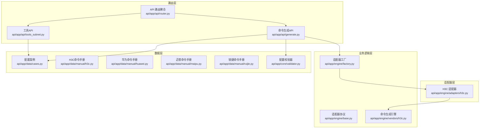
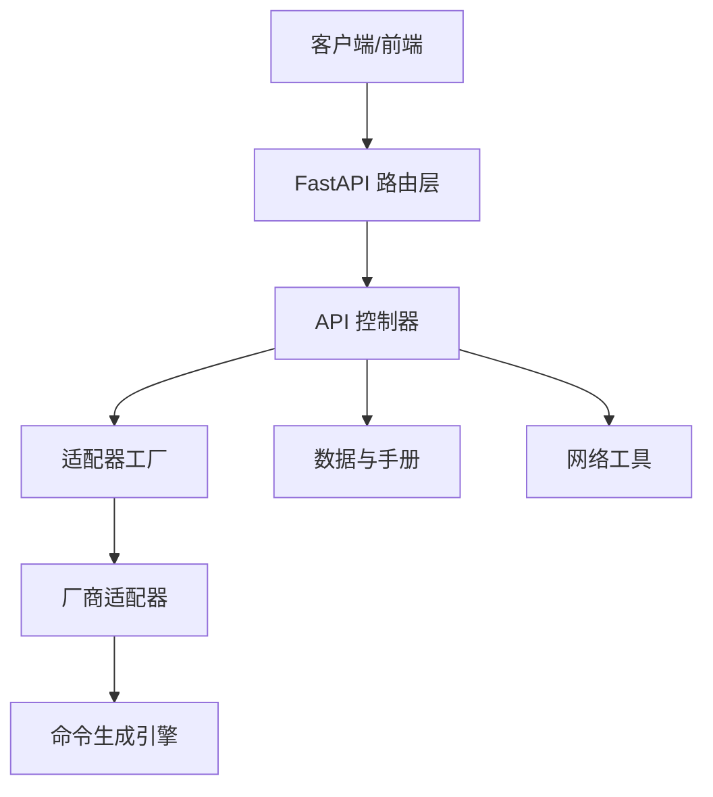
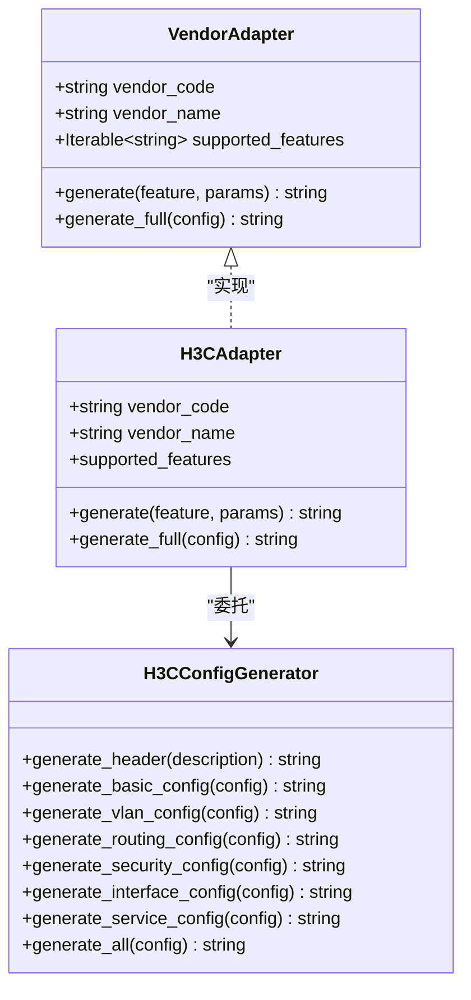
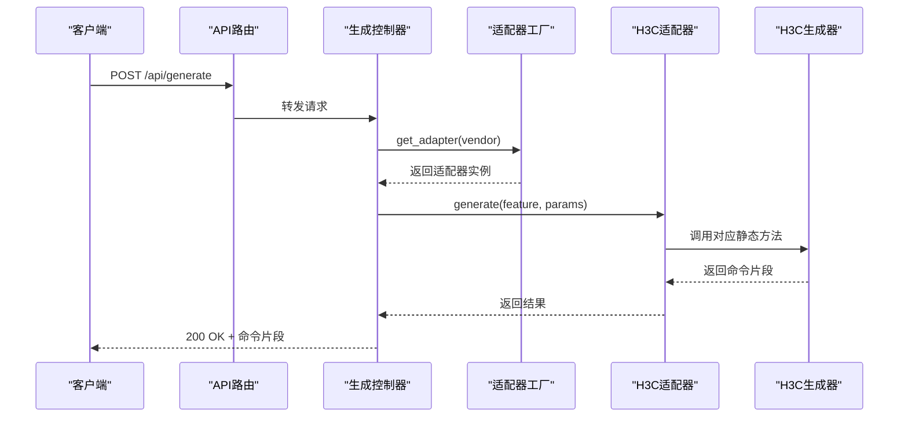
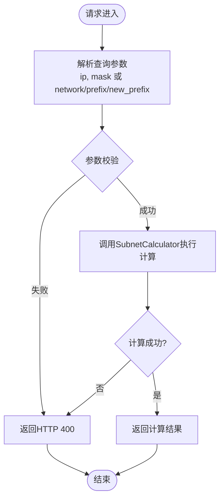
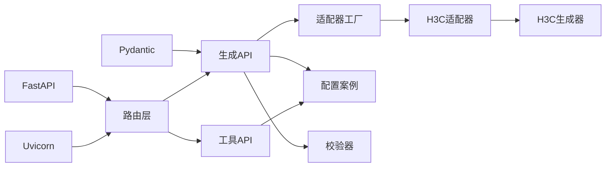

# 系统架构设计

<cite>
**本文档引用的文件**
- [api/app/engine/base.py](file://api/app/engine/base.py)
- [api/app/engine/factory.py](file://api/app/engine/factory.py)
- [api/app/engine/adapters/h3c.py](file://api/app/engine/adapters/h3c.py)
- [api/app/engine/vendors/h3c.py](file://api/app/engine/vendors/h3c.py)
- [api/app/api/generate.py](file://api/app/api/generate.py)
- [api/app/api/router.py](file://api/app/api/router.py)
- [api/app/api/tools_subnet.py](file://api/app/api/tools_subnet.py)
- [api/app/data/cases.py](file://api/app/data/cases.py)
- [api/app/data/manual/h3c.py](file://api/app/data/manual/h3c.py)
- [api/app/data/manual/huawei.py](file://api/app/data/manual/huawei.py)
- [api/app/data/manual/maipu.py](file://api/app/data/manual/maipu.py)
- [api/app/data/manual/ruijie.py](file://api/app/data/manual/ruijie.py)
- [api/app/core/validator.py](file://api/app/core/validator.py)
- [api/requirements.txt](file://api/requirements.txt)
</cite>

## 目录
1. [引言](#引言)
2. [项目结构](#项目结构)
3. [核心组件](#核心组件)
4. [架构总览](#架构总览)
5. [详细组件分析](#详细组件分析)
6. [依赖关系分析](#依赖关系分析)
7. [性能考虑](#性能考虑)
8. [故障排除指南](#故障排除指南)
9. [结论](#结论)
10. [附录](#附录)

## 引言
本项目是一个面向网络设备命令生成的Web服务，提供统一的REST API接口，支持多家厂商（如H3C、华为、锐捷、迈普）的配置命令生成与网络工具计算能力。系统采用分层架构设计，通过适配器模式与工厂模式解耦不同厂商的实现差异，确保业务逻辑与底层实现的松耦合。

## 项目结构
项目主要分为以下层次与模块：
- 路由层：FastAPI路由聚合与API端点定义
- 业务逻辑层：命令生成引擎与适配器工厂
- 适配器层：各厂商适配器实现
- 数据层：厂商命令手册、配置案例与校验工具
- 工具层：网络工具（子网计算等）

**图表来源**
- [api/app/api/router.py:1-10](file://api/app/api/router.py#L1-L10)
- [api/app/api/generate.py:1-77](file://api/app/api/generate.py#L1-L77)
- [api/app/api/tools_subnet.py:1-50](file://api/app/api/tools_subnet.py#L1-L50)
- [api/app/engine/factory.py:1-39](file://api/app/engine/factory.py#L1-L39)
- [api/app/engine/base.py:1-36](file://api/app/engine/base.py#L1-L36)
- [api/app/engine/adapters/h3c.py:1-42](file://api/app/engine/adapters/h3c.py#L1-L42)
- [api/app/engine/vendors/h3c.py:1-594](file://api/app/engine/vendors/h3c.py#L1-L594)
- [api/app/data/cases.py:1-377](file://api/app/data/cases.py#L1-L377)
- [api/app/data/manual/h3c.py:1-710](file://api/app/data/manual/h3c.py#L1-L710)
- [api/app/data/manual/huawei.py:1-703](file://api/app/data/manual/huawei.py#L1-L703)
- [api/app/data/manual/maipu.py:1-634](file://api/app/data/manual/maipu.py#L1-L634)
- [api/app/data/manual/ruijie.py:1-2045](file://api/app/data/manual/ruijie.py#L1-L2045)
- [api/app/core/validator.py:1-208](file://api/app/core/validator.py#L1-L208)

**章节来源**
- [api/app/api/router.py:1-10](file://api/app/api/router.py#L1-L10)
- [api/app/api/generate.py:1-77](file://api/app/api/generate.py#L1-L77)
- [api/app/api/tools_subnet.py:1-50](file://api/app/api/tools_subnet.py#L1-L50)
- [api/app/engine/factory.py:1-39](file://api/app/engine/factory.py#L1-L39)
- [api/app/engine/base.py:1-36](file://api/app/engine/base.py#L1-L36)
- [api/app/engine/adapters/h3c.py:1-42](file://api/app/engine/adapters/h3c.py#L1-L42)
- [api/app/engine/vendors/h3c.py:1-594](file://api/app/engine/vendors/h3c.py#L1-L594)
- [api/app/data/cases.py:1-377](file://api/app/data/cases.py#L1-L377)
- [api/app/data/manual/h3c.py:1-710](file://api/app/data/manual/h3c.py#L1-L710)
- [api/app/data/manual/huawei.py:1-703](file://api/app/data/manual/huawei.py#L1-L703)
- [api/app/data/manual/maipu.py:1-634](file://api/app/data/manual/maipu.py#L1-L634)
- [api/app/data/manual/ruijie.py:1-2045](file://api/app/data/manual/ruijie.py#L1-L2045)
- [api/app/core/validator.py:1-208](file://api/app/core/validator.py#L1-L208)

## 核心组件
- 适配器协议与工厂
  - 通过统一的VendorAdapter协议约束适配器接口，工厂负责实例化与分发，实现“对扩展开放、对修改封闭”的设计原则。
- 命令生成引擎
  - 将高层配置字典转换为具体厂商的命令脚本，支持特性级与全量配置生成。
- API路由与控制器
  - 提供命令生成与网络工具的REST接口，统一请求参数与响应格式。
- 数据与手册
  - 包含厂商命令手册、配置案例与校验工具，支撑生成逻辑与质量保障。
- 外部依赖
  - FastAPI、Uvicorn、Pydantic等，提供高性能异步Web框架与数据校验能力。

**章节来源**
- [api/app/engine/base.py:1-36](file://api/app/engine/base.py#L1-L36)
- [api/app/engine/factory.py:1-39](file://api/app/engine/factory.py#L1-L39)
- [api/app/engine/vendors/h3c.py:1-594](file://api/app/engine/vendors/h3c.py#L1-L594)
- [api/app/api/generate.py:1-77](file://api/app/api/generate.py#L1-L77)
- [api/app/api/router.py:1-10](file://api/app/api/router.py#L1-L10)
- [api/app/data/cases.py:1-377](file://api/app/data/cases.py#L1-L377)
- [api/app/core/validator.py:1-208](file://api/app/core/validator.py#L1-L208)
- [api/requirements.txt:1-5](file://api/requirements.txt#L1-L5)

## 架构总览
系统采用清晰的分层架构：
- 表现层（路由层）：FastAPI路由聚合，暴露REST API端点。
- 控制层（业务逻辑层）：工厂与适配器协调，完成请求到命令生成的转换。
- 适配层（厂商适配器）：针对不同厂商的适配器实现，屏蔽厂商差异。
- 数据层（手册与案例）：提供命令参考、最佳实践与配置校验。
- 工具层（网络工具）：提供子网计算等辅助能力。

**图表来源**
- [api/app/api/router.py:1-10](file://api/app/api/router.py#L1-L10)
- [api/app/api/generate.py:1-77](file://api/app/api/generate.py#L1-L77)
- [api/app/engine/factory.py:1-39](file://api/app/engine/factory.py#L1-L39)
- [api/app/engine/adapters/h3c.py:1-42](file://api/app/engine/adapters/h3c.py#L1-L42)
- [api/app/engine/vendors/h3c.py:1-594](file://api/app/engine/vendors/h3c.py#L1-L594)
- [api/app/api/tools_subnet.py:1-50](file://api/app/api/tools_subnet.py#L1-L50)

## 详细组件分析

### 组件A：适配器模式与工厂模式
- 适配器协议
  - 定义统一的VendorAdapter接口，包括厂商代码、名称、支持特性集合以及generate/generate_full方法。
- 工厂模式
  - 通过单例字典集中管理适配器实例，提供get_adapter与list_vendors能力，实现“按需加载、按名索引”。
- H3C适配器
  - 将特性码映射到H3CConfigGenerator的静态方法，实现特性级与全量配置生成。

**图表来源**
- [api/app/engine/base.py:11-28](file://api/app/engine/base.py#L11-L28)
- [api/app/engine/adapters/h3c.py:14-42](file://api/app/engine/adapters/h3c.py#L14-L42)
- [api/app/engine/vendors/h3c.py:11-594](file://api/app/engine/vendors/h3c.py#L11-L594)

**章节来源**
- [api/app/engine/base.py:1-36](file://api/app/engine/base.py#L1-L36)
- [api/app/engine/factory.py:1-39](file://api/app/engine/factory.py#L1-L39)
- [api/app/engine/adapters/h3c.py:1-42](file://api/app/engine/adapters/h3c.py#L1-L42)
- [api/app/engine/vendors/h3c.py:1-594](file://api/app/engine/vendors/h3c.py#L1-L594)

### 组件B：API工作流（命令生成）
- 请求处理
  - 生成单个特性：POST /api/generate，接收vendor、feature、params，返回生成的命令片段。
  - 生成完整配置：POST /api/generate/full，接收vendor、config，返回完整脚本。
  - 列出厂商：GET /api/vendors，返回支持的厂商列表与特性集合。
- 错误处理
  - 对未支持厂商与特性进行捕获并返回HTTP 4xx错误。
- 数据与校验
  - 结合data/cases与core/validator提供配置参考与参数校验。

**图表来源**
- [api/app/api/generate.py:53-76](file://api/app/api/generate.py#L53-L76)
- [api/app/engine/factory.py:20-26](file://api/app/engine/factory.py#L20-L26)
- [api/app/engine/adapters/h3c.py:32-38](file://api/app/engine/adapters/h3c.py#L32-L38)
- [api/app/engine/vendors/h3c.py:26-125](file://api/app/engine/vendors/h3c.py#L26-L125)

**章节来源**
- [api/app/api/generate.py:1-77](file://api/app/api/generate.py#L1-L77)
- [api/app/engine/factory.py:1-39](file://api/app/engine/factory.py#L1-L39)
- [api/app/engine/adapters/h3c.py:1-42](file://api/app/engine/adapters/h3c.py#L1-L42)
- [api/app/engine/vendors/h3c.py:1-594](file://api/app/engine/vendors/h3c.py#L1-L594)

### 组件C：网络工具API（子网计算）
- 端点
  - GET /api/tools/subnet：根据IP与掩码计算网络信息。
  - GET /api/tools/subnet/split：将网段按新前缀长度切分为子网。
  - GET /api/tools/subnet/range-to-cidr：将IP范围转换为最少CIDR块。
- 参数校验
  - 使用SubnetCalculator进行合法性校验，失败时返回HTTP 400。

**图表来源**
- [api/app/api/tools_subnet.py:9-49](file://api/app/api/tools_subnet.py#L9-L49)

**章节来源**
- [api/app/api/tools_subnet.py:1-50](file://api/app/api/tools_subnet.py#L1-L50)

### 组件D：数据与手册（命令参考与最佳实践）
- COMMAND_REFERENCES
  - 提供多厂商命令参考，包含基础、VLAN、路由、安全、接口、管理等类别。
- BEST_PRACTICES
  - 提供安全基线、网络设计、运维管理等最佳实践清单。
- SHORTCUTS
  - 提供通用快捷键与视图切换说明。
- 厂商命令手册
  - H3C、华为、锐捷、迈普的完整命令手册与配置案例，支撑生成逻辑与验证。

**章节来源**
- [api/app/data/cases.py:1-377](file://api/app/data/cases.py#L1-L377)
- [api/app/data/manual/h3c.py:1-710](file://api/app/data/manual/h3c.py#L1-L710)
- [api/app/data/manual/huawei.py:1-703](file://api/app/data/manual/huawei.py#L1-L703)
- [api/app/data/manual/maipu.py:1-634](file://api/app/data/manual/maipu.py#L1-L634)
- [api/app/data/manual/ruijie.py:1-2045](file://api/app/data/manual/ruijie.py#L1-L2045)

### 组件E：配置校验器
- 功能
  - 提供IP地址、子网掩码、VLAN ID、接口名称、MAC地址、主机名、密码强度、端口号、AS号、反掩码等校验方法。
- 应用
  - 在API层与工具层结合使用，确保输入参数的合法性与一致性。

**章节来源**
- [api/app/core/validator.py:1-208](file://api/app/core/validator.py#L1-L208)

## 依赖关系分析
- 内部依赖
  - API路由依赖生成控制器与工具控制器。
  - 生成控制器依赖适配器工厂与数据/校验模块。
  - 适配器依赖命令生成引擎与厂商手册。
- 外部依赖
  - FastAPI、Uvicorn、Pydantic等提供Web框架与数据校验能力。

**图表来源**
- [api/requirements.txt:1-5](file://api/requirements.txt#L1-L5)
- [api/app/api/router.py:1-10](file://api/app/api/router.py#L1-L10)
- [api/app/api/generate.py:1-77](file://api/app/api/generate.py#L1-L77)
- [api/app/api/tools_subnet.py:1-50](file://api/app/api/tools_subnet.py#L1-L50)
- [api/app/engine/factory.py:1-39](file://api/app/engine/factory.py#L1-L39)
- [api/app/engine/adapters/h3c.py:1-42](file://api/app/engine/adapters/h3c.py#L1-L42)
- [api/app/engine/vendors/h3c.py:1-594](file://api/app/engine/vendors/h3c.py#L1-L594)
- [api/app/data/cases.py:1-377](file://api/app/data/cases.py#L1-L377)
- [api/app/core/validator.py:1-208](file://api/app/core/validator.py#L1-L208)

**章节来源**
- [api/requirements.txt:1-5](file://api/requirements.txt#L1-L5)

## 性能考虑
- 适配器复用
  - 工厂采用单例字典缓存适配器实例，避免重复创建，提升并发性能。
- 生成器无状态
  - H3CConfigGenerator为纯静态方法，适合无状态调用，减少上下文开销。
- 异步运行
  - 基于FastAPI/Uvicorn的异步模型，适合I/O密集型场景（如网络工具计算）。
- 参数校验前置
  - 在API层进行参数校验，提前失败，减少无效调用成本。

[本节为通用指导，无需具体文件引用]

## 故障排除指南
- 常见错误
  - 未支持厂商：返回HTTP 400，提示可选厂商列表。
  - 未支持特性：返回HTTP 400，提示该厂商支持的特性集合。
  - 生成失败：捕获异常并返回HTTP 500，包含失败原因。
- 排查步骤
  - 检查vendor与feature是否在list_vendors返回范围内。
  - 核对params/config结构是否符合厂商生成器期望。
  - 使用校验器验证关键参数（如IP、VLAN ID、接口名）。
- 相关实现
  - API层错误处理与HTTP状态码映射。
  - 适配器层特性支持检查与异常抛出。

**章节来源**
- [api/app/api/generate.py:58-76](file://api/app/api/generate.py#L58-L76)
- [api/app/engine/factory.py:20-26](file://api/app/engine/factory.py#L20-L26)
- [api/app/engine/adapters/h3c.py:32-38](file://api/app/engine/adapters/h3c.py#L32-L38)
- [api/app/core/validator.py:202-208](file://api/app/core/validator.py#L202-L208)

## 结论
本系统通过分层架构与适配器/工厂模式，实现了对多厂商命令生成的统一抽象与扩展。路由层简洁明确，业务逻辑层通过工厂与协议解耦，适配器层屏蔽厂商差异，数据层提供权威参考与校验。整体设计具备良好的可维护性、可扩展性与性能表现，适合持续演进与企业级应用。

## 附录
- 系统边界
  - 内部：命令生成引擎、适配器工厂、API控制器、数据与工具模块。
  - 外部：FastAPI/Uvicorn运行时、网络工具依赖。
- 集成接口
  - REST API：/api/generate、/api/generate/full、/api/vendors、/api/tools/*。
- 技术决策权衡
  - 选择FastAPI/Uvicorn以获得高性能与自动OpenAPI文档。
  - 采用工厂+适配器模式平衡扩展性与复杂度。
  - 将生成器设计为无状态静态方法，简化并发与缓存策略。

[本节为总结性内容，无需具体文件引用]