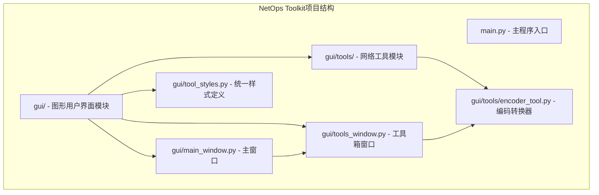
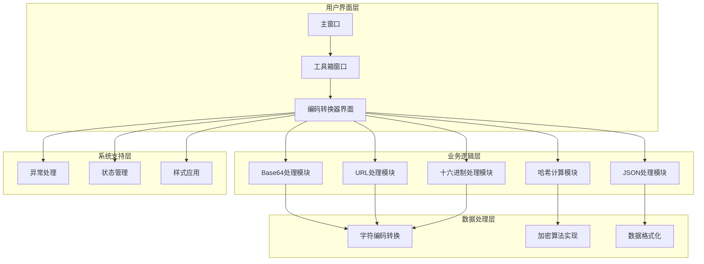
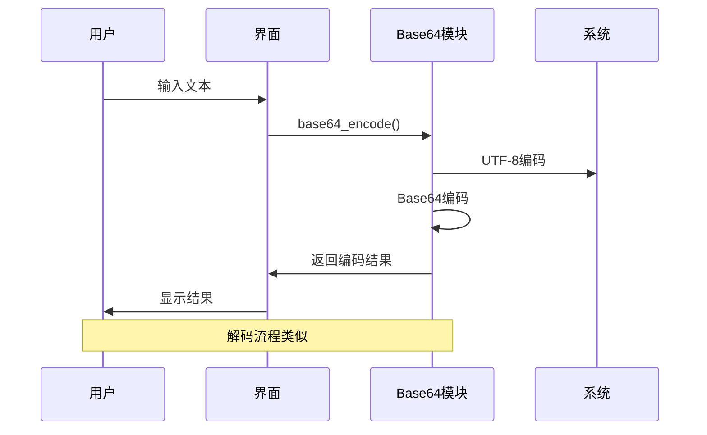
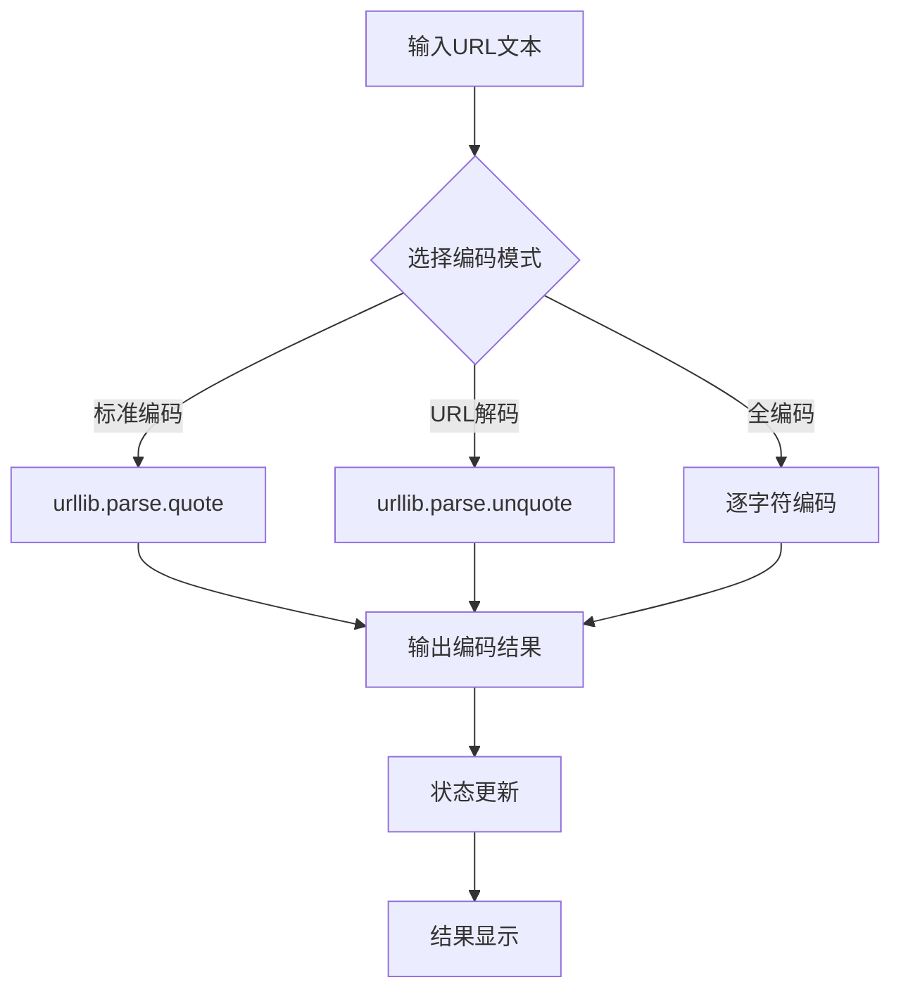
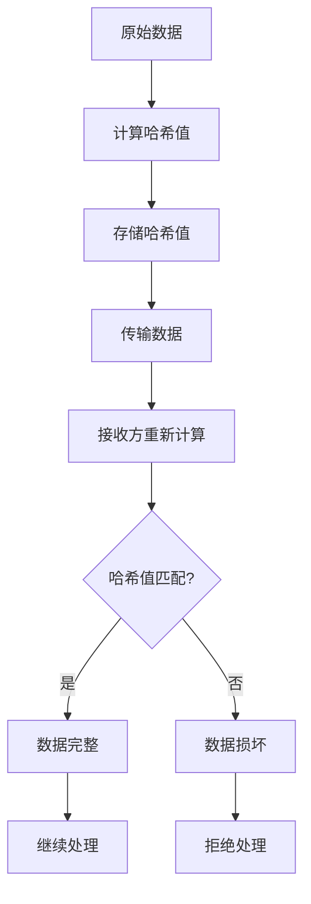

# 编码转换工具

<cite>
**本文档引用的文件**
- [encoder_tool.py](file://opensource/NetOps-toolkit/gui/tools/encoder_tool.py)
- [main_window.py](file://opensource/NetOps-toolkit/gui/main_window.py)
- [tools_window.py](file://opensource/NetOps-toolkit/gui/tools_window.py)
- [tool_styles.py](file://opensource/NetOps-toolkit/gui/tool_styles.py)
- [README.md](file://opensource/NetOps-toolkit/README.md)
</cite>

## 目录
1. [简介](#简介)
2. [项目结构](#项目结构)
3. [核心组件](#核心组件)
4. [架构概览](#架构概览)
5. [详细组件分析](#详细组件分析)
6. [使用指南](#使用指南)
7. [应用场景](#应用场景)
8. [安全最佳实践](#安全最佳实践)
9. [故障排除指南](#故障排除指南)
10. [结论](#结论)

## 简介

编码转换工具是NetOps Toolkit v4.0中的一个重要功能模块，专门用于处理各种编码格式转换任务。该工具提供了完整的编码转换解决方案，包括Base64编码解码、URL编码解码、十六进制转换、MD5/SHA哈希计算和文本编码转换等功能。

NetOps Toolkit是一个功能强大、现代化界面的多品牌交换机配置生成工具，支持华为/H3C/锐捷/迈普四大品牌，内置11+网络工具，基于Python + PyQt5开发。编码转换工具作为其中的一个重要组成部分，为网络运维工程师提供了便捷的数据处理能力。

## 项目结构

编码转换工具在项目中的组织结构如下：

**图表来源**
- [encoder_tool.py:1-445](file://opensource/NetOps-toolkit/gui/tools/encoder_tool.py#L1-L445)
- [main_window.py:144-436](file://opensource/NetOps-toolkit/gui/main_window.py#L144-L436)
- [tools_window.py:28-77](file://opensource/NetOps-toolkit/gui/tools_window.py#L28-L77)

**章节来源**
- [encoder_tool.py:1-445](file://opensource/NetOps-toolkit/gui/tools/encoder_tool.py#L1-L445)
- [main_window.py:144-436](file://opensource/NetOps-toolkit/gui/main_window.py#L144-L436)
- [tools_window.py:28-77](file://opensource/NetOps-toolkit/gui/tools_window.py#L28-L77)

## 核心组件

编码转换工具采用模块化设计，主要包含以下核心组件：

### 主要功能模块

1. **Base64编码解码器** - 支持文本的Base64编码和解码操作
2. **URL编码解码器** - 提供标准URL编码、解码和全编码功能
3. **十六进制转换器** - 实现文本与十六进制字符串之间的双向转换
4. **JSON处理器** - 提供JSON格式化、压缩、转义和去转义功能
5. **哈希计算器** - 计算MD5、SHA1、SHA256和SHA512哈希值

### 技术架构特点

- **基于PyQt5的GUI框架** - 提供现代化的图形用户界面
- **UTF-8字符集支持** - 确保国际化文本的正确处理
- **异常处理机制** - 完善的错误捕获和用户反馈系统
- **统一样式管理** - 一致的视觉设计和用户体验

**章节来源**
- [encoder_tool.py:30-288](file://opensource/NetOps-toolkit/gui/tools/encoder_tool.py#L30-L288)

## 架构概览

编码转换工具的整体架构采用分层设计，确保功能模块的独立性和可维护性：

**图表来源**
- [main_window.py:498-554](file://opensource/NetOps-toolkit/gui/main_window.py#L498-L554)
- [tools_window.py:28-77](file://opensource/NetOps-toolkit/gui/tools_window.py#L28-L77)
- [encoder_tool.py:30-445](file://opensource/NetOps-toolkit/gui/tools/encoder_tool.py#L30-L445)

## 详细组件分析

### Base64编码解码器

Base64编码解码器是编码转换工具的核心功能之一，提供了完整的二进制数据编码和解码能力。

#### 功能特性

- **文本编码** - 将任意文本转换为Base64格式
- **数据解码** - 将Base64格式还原为原始文本
- **UTF-8支持** - 确保多字节字符的正确处理
- **实时反馈** - 操作状态的即时提示

#### 数据流处理

**图表来源**
- [encoder_tool.py:295-318](file://opensource/NetOps-toolkit/gui/tools/encoder_tool.py#L295-L318)

#### 错误处理机制

Base64模块实现了完善的异常处理：
- 编码失败时返回详细错误信息
- 解码失败时进行格式验证
- 空输入处理和边界条件检查

**章节来源**
- [encoder_tool.py:295-318](file://opensource/NetOps-toolkit/gui/tools/encoder_tool.py#L295-L318)

### URL编码解码器

URL编码解码器提供了多种URL处理模式，满足不同场景下的数据传输需求。

#### 编码模式

1. **标准URL编码** - 使用urllib.parse.quote进行编码
2. **URL解码** - 使用urllib.parse.unquote进行解码  
3. **全编码模式** - 对每个字符进行百分号编码

#### 处理流程

**图表来源**
- [encoder_tool.py:319-348](file://opensource/NetOps-toolkit/gui/tools/encoder_tool.py#L319-L348)

**章节来源**
- [encoder_tool.py:319-348](file://opensource/NetOps-toolkit/gui/tools/encoder_tool.py#L319-L348)

### 十六进制转换器

十六进制转换器实现了文本与十六进制字符串之间的双向转换，支持多种输入格式。

#### 转换功能

- **文本转十六进制** - 使用encode('utf-8').hex()实现
- **十六进制转文本** - 使用bytes.fromhex().decode('utf-8')
- **格式清理** - 自动处理空格、前缀等格式问题

#### 输入格式支持

转换器能够智能识别和处理以下格式：
- 纯十六进制字符串
- 包含空格的格式化字符串
- 带有0x前缀的十六进制数
- 带有\x转义序列的格式

**章节来源**
- [encoder_tool.py:349-368](file://opensource/NetOps-toolkit/gui/tools/encoder_tool.py#L349-L368)

### JSON处理器

JSON处理器提供了完整的JSON数据处理能力，包括格式化、压缩、转义和去转义功能。

#### 处理能力

1. **格式化** - 添加适当的缩进和换行
2. **压缩** - 移除不必要的空白字符
3. **转义** - 将字符串转换为JSON安全格式
4. **去转义** - 解析JSON格式的字符串

#### 数据验证

JSON处理器内置了完整的数据验证机制：
- 格式化前进行语法检查
- 压缩时保持数据完整性
- 转义和去转义的双向一致性

**章节来源**
- [encoder_tool.py:369-413](file://opensource/NetOps-toolkit/gui/tools/encoder_tool.py#L369-L413)

### 哈希计算器

哈希计算器支持多种哈希算法，为数据完整性验证和安全应用提供支持。

#### 支持的算法

- **MD5** - 128位哈希值，适用于数据完整性检查
- **SHA1** - 160位哈希值，较老但广泛使用的算法
- **SHA256** - 256位哈希值，推荐的安全算法
- **SHA512** - 512位哈希值，最高安全级别的算法

#### 输出格式

哈希计算器提供结构化的输出格式，包含：
- 输入文本长度统计
- 各算法的哈希值
- 格式化的结果展示

**章节来源**
- [encoder_tool.py:414-439](file://opensource/NetOps-toolkit/gui/tools/encoder_tool.py#L414-L439)

## 使用指南

### 启动和访问

编码转换工具可以通过两种方式访问：

#### 方法一：通过主菜单访问
1. 打开NetOps Toolkit主程序
2. 点击菜单栏的"网络工具"选项
3. 选择"编码转换器"菜单项
4. 弹出编码转换器对话框

#### 方法二：通过工具箱访问
1. 在主窗口中点击"打开工具箱"
2. 在工具箱窗口中找到"编码转换"标签页
3. 直接使用编码转换功能

### Base64编码解码操作

#### Base64编码步骤

1. 在"Base64"标签页中，将需要编码的文本输入到输入框
2. 点击"🔒 Base64 编码"按钮
3. 查看结果框中的编码结果
4. 如需复制结果，点击"📋 复制结果"按钮

#### Base64解码步骤

1. 在"Base64"标签页中，将Base64编码的文本输入到输入框
2. 点击"🔓 Base64 解码"按钮
3. 查看结果框中的解码结果
4. 如需复制结果，点击"📋 复制结果"按钮

### URL编码解码操作

#### URL编码步骤

1. 在"URL"标签页中，将需要编码的URL文本输入到输入框
2. 点击相应的编码按钮：
   - "🔒 URL 编码" - 标准URL编码
   - "🔒 全编码" - 对每个字符进行编码
3. 查看结果框中的编码结果

#### URL解码步骤

1. 在"URL"标签页中，将需要解码的URL文本输入到输入框
2. 点击"🔓 URL 解码"按钮
3. 查看结果框中的解码结果

### 十六进制转换操作

#### 文本转十六进制

1. 在"🔢 Hex"标签页中，将需要转换的文本输入到输入框
2. 点击"文本 → Hex"按钮
3. 查看结果框中的十六进制字符串

#### 十六进制转文本

1. 在"🔢 Hex"标签页中，将十六进制字符串输入到输入框
2. 支持的格式：纯十六进制、带空格、0x前缀、\x转义
3. 点击"Hex → 文本"按钮
4. 查看结果框中的原始文本

### JSON处理操作

#### JSON格式化

1. 在"📄 JSON"标签页中，将需要格式化的JSON文本输入到输入框
2. 点击"✨ 格式化"按钮
3. 查看格式化后的结果

#### JSON压缩

1. 在"📄 JSON"标签页中，将需要压缩的JSON文本输入到输入框
2. 点击"📦 压缩"按钮
3. 查看压缩后的结果

#### JSON转义和去转义

1. 在"📄 JSON"标签页中，输入需要处理的JSON文本
2. 点击相应的按钮进行转义或去转义操作
3. 查看处理后的结果

### 哈希计算操作

#### 哈希计算步骤

1. 在"#️⃣ Hash"标签页中，将需要计算哈希的文本输入到输入框
2. 点击"🔍 计算哈希"按钮
3. 查看结果框中显示的MD5、SHA1、SHA256和SHA512哈希值

### 状态管理和错误处理

编码转换工具提供了完善的状态管理和错误处理机制：

#### 状态指示

- **成功状态**：绿色提示，显示"✅ 操作成功"
- **错误状态**：红色提示，显示"❌ 操作失败"
- **就绪状态**：灰色提示，显示"就绪"

#### 错误处理

- 所有操作都包含try-catch异常处理
- 失败时返回详细的错误信息
- 状态栏实时显示操作状态

**章节来源**
- [encoder_tool.py:295-445](file://opensource/NetOps-toolkit/gui/tools/encoder_tool.py#L295-L445)

## 应用场景

### 数据传输场景

编码转换工具在数据传输场景中有广泛应用：

#### Web API集成
- **URL编码**：处理特殊字符，确保URL的正确传输
- **Base64编码**：编码二进制数据，便于在HTTP请求中传输
- **JSON格式化**：提供清晰的API响应格式

#### 文件上传处理
- **Base64编码**：将文件内容编码为文本格式
- **哈希验证**：验证文件的完整性
- **字符编码**：处理多语言文件的编码问题

### 安全验证场景

#### 数据完整性验证
- **MD5/SHA哈希**：验证数据传输的完整性
- **数字签名**：结合公钥加密进行身份验证
- **密码存储**：安全地存储用户密码

#### 访问控制
- **令牌生成**：生成临时访问令牌
- **会话管理**：处理用户会话标识
- **权限验证**：验证用户权限信息

### 文本处理场景

#### 数据库操作
- **SQL注入防护**：对用户输入进行适当的编码
- **数据格式化**：确保数据在数据库中的正确存储
- **字符集转换**：处理不同字符集之间的转换

#### 配置文件管理
- **配置参数编码**：处理特殊字符的配置参数
- **模板渲染**：对模板变量进行适当的编码
- **日志记录**：安全地记录敏感信息

### 开发调试场景

#### 调试工具
- **数据格式化**：将复杂数据结构转换为易读格式
- **编码测试**：验证不同编码方案的正确性
- **性能测试**：比较不同算法的性能表现

#### 开发辅助
- **API测试**：快速测试API接口的编码处理
- **数据转换**：在不同数据格式之间进行转换
- **格式验证**：验证数据格式的正确性

## 安全最佳实践

### 编码安全考虑

#### Base64编码安全
- **避免敏感信息明文传输**：使用Base64编码保护敏感数据
- **注意字符集问题**：确保正确的字符编码处理
- **验证解码结果**：解码后验证数据的完整性

#### URL编码安全
- **全面编码策略**：使用全编码模式处理所有特殊字符
- **输入验证**：对用户输入进行严格的验证
- **输出清理**：确保输出内容的安全性

#### 哈希算法选择
- **优先使用SHA256或更高**：避免使用MD5和SHA1
- **盐值使用**：在密码存储中使用随机盐值
- **算法升级**：定期评估和升级哈希算法

### 数据完整性最佳实践

#### 哈希验证流程

#### 数据传输安全
- **双重验证**：同时使用多种验证方法
- **超时处理**：设置合理的超时机制
- **重传机制**：实现失败重传的可靠机制

### 字符集处理最佳实践

#### UTF-8统一处理
- **统一字符集**：在整个系统中使用UTF-8
- **编码转换**：确保跨平台的编码一致性
- **显示优化**：正确处理多字节字符的显示

#### 特殊字符处理
- **白名单验证**：只允许安全的字符
- **黑名单过滤**：阻止危险字符的输入
- **转义机制**：对特殊字符进行适当的转义

### 错误处理和监控

#### 异常处理策略
- **全面捕获**：捕获所有可能的异常情况
- **详细记录**：记录详细的错误信息和上下文
- **用户友好**：向用户提供清晰的错误提示

#### 性能监控
- **执行时间监控**：监控各项操作的执行时间
- **内存使用监控**：监控内存使用情况
- **资源清理**：及时清理临时资源

## 故障排除指南

### 常见问题和解决方案

#### Base64解码失败

**问题症状**：
- 解码操作抛出异常
- 结果框显示"解码失败"信息

**可能原因**：
- 输入的不是有效的Base64字符串
- 字符串包含非法字符
- 字符串长度不正确

**解决方法**：
1. 检查输入的Base64字符串格式
2. 确认字符串中没有额外的空白字符
3. 验证字符串的长度是否为4的倍数
4. 使用"📋 复制结果"功能检查原始数据

#### URL编码异常

**问题症状**：
- URL编码或解码操作失败
- 结果显示乱码或错误字符

**可能原因**：
- 输入包含不支持的字符
- 编码参数设置错误
- 字符集处理问题

**解决方法**：
1. 确认输入文本的字符集
2. 尝试不同的编码模式
3. 检查特殊字符的处理
4. 使用标准的URL字符集

#### 十六进制转换错误

**问题症状**：
- 十六进制转换失败
- 抛出ValueError异常

**可能原因**：
- 输入包含非十六进制字符
- 格式不正确（如多余的空格）
- 字符串长度为奇数

**解决方法**：
1. 检查输入字符串是否只包含0-9和A-F字符
2. 移除多余的空格和特殊字符
3. 确认字符串长度为偶数
4. 尝试不同的输入格式

#### JSON处理错误

**问题症状**：
- JSON格式化或解析失败
- 抛出JSONDecodeError异常

**可能原因**：
- JSON语法不正确
- 字符编码问题
- 特殊字符未正确转义

**解决方法**：
1. 使用在线JSON验证工具检查语法
2. 确认文件的字符编码
3. 手动转义特殊字符
4. 分步处理复杂的JSON结构

### 性能问题诊断

#### 处理速度慢

**可能原因**：
- 处理大量数据时的性能瓶颈
- 内存使用过高
- GUI线程阻塞

**优化建议**：
1. 对于大文件，考虑分块处理
2. 实施进度条和取消机制
3. 使用异步处理避免界面冻结
4. 优化内存使用，及时释放资源

#### 内存泄漏

**问题症状**：
- 长时间使用后内存占用持续增加
- 应用程序运行缓慢

**预防措施**：
1. 确保正确释放GUI对象
2. 及时清理临时数据结构
3. 使用弱引用避免循环引用
4. 定期进行内存清理

### 调试技巧

#### 日志记录

启用详细的日志记录来跟踪问题：
1. 检查状态栏的详细错误信息
2. 查看应用程序的事件日志
3. 使用调试模式进行问题定位

#### 数据验证

实施数据验证机制：
1. 验证输入数据的格式和范围
2. 检查中间结果的正确性
3. 确保输出数据的一致性

#### 单元测试

编写针对关键功能的单元测试：
1. 测试各种边界条件
2. 验证错误处理机制
3. 确保功能的稳定性

**章节来源**
- [encoder_tool.py:295-445](file://opensource/NetOps-toolkit/gui/tools/encoder_tool.py#L295-L445)

## 结论

编码转换工具作为NetOps Toolkit的重要组成部分，为网络运维工程师提供了全面的数据处理能力。该工具具有以下显著优势：

### 技术优势

- **功能完整**：涵盖了现代软件开发中常用的编码转换需求
- **用户友好**：直观的图形界面和清晰的操作流程
- **安全可靠**：完善的错误处理和安全验证机制
- **性能优秀**：高效的算法实现和优化的用户界面

### 应用价值

- **提高工作效率**：自动化处理重复性的编码转换任务
- **降低错误率**：减少手动处理导致的错误
- **增强安全性**：提供安全的编码和验证机制
- **支持国际化**：完整的UTF-8字符集支持

### 发展前景

随着网络安全和数据处理需求的不断增长，编码转换工具将继续演进，可能的发展方向包括：
- 支持更多编码格式和算法
- 增强批量处理能力
- 优化性能和用户体验
- 扩展到更多的应用场景

编码转换工具不仅是一个实用的工具，更是NetOps Toolkit整体架构中不可或缺的一部分，为整个网络运维工具集提供了坚实的技术基础。