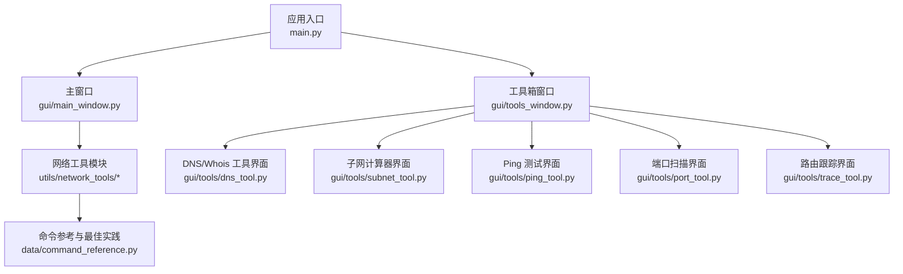
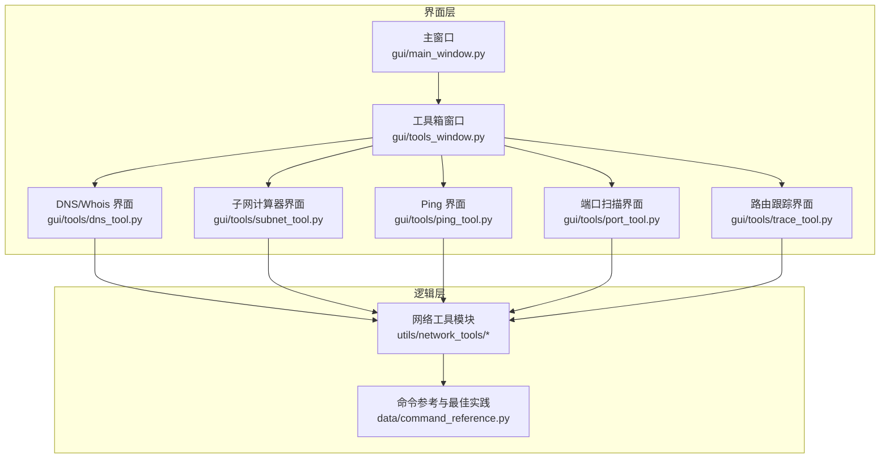
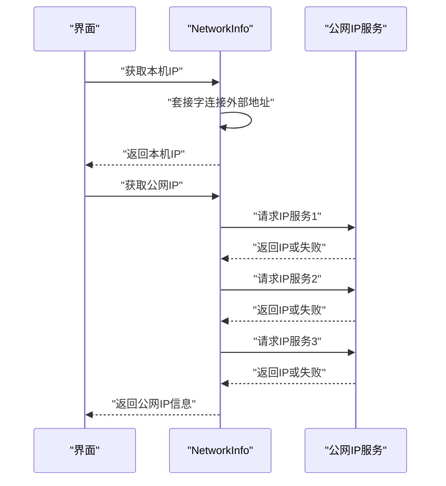
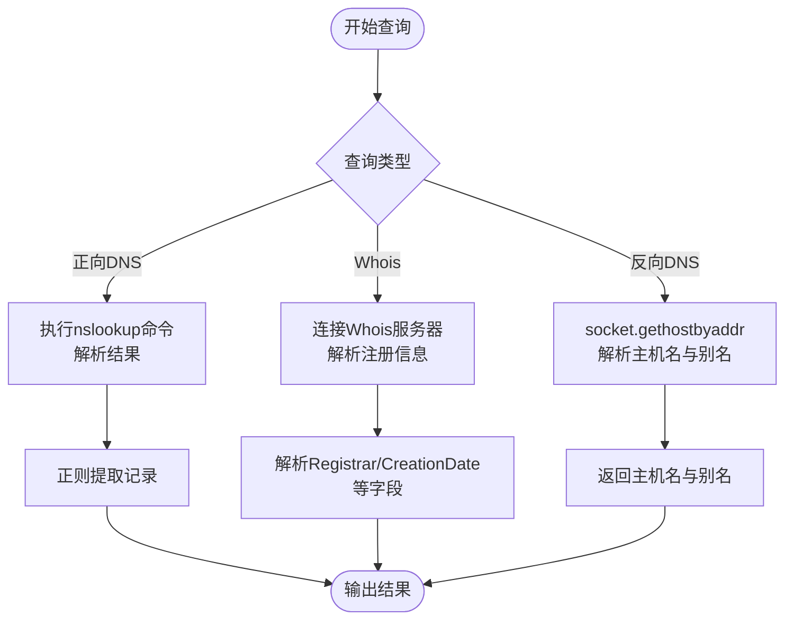
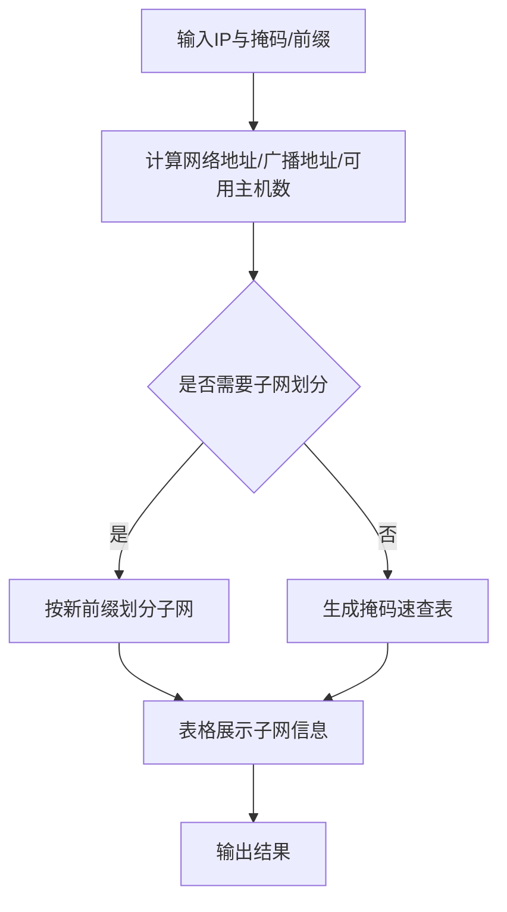
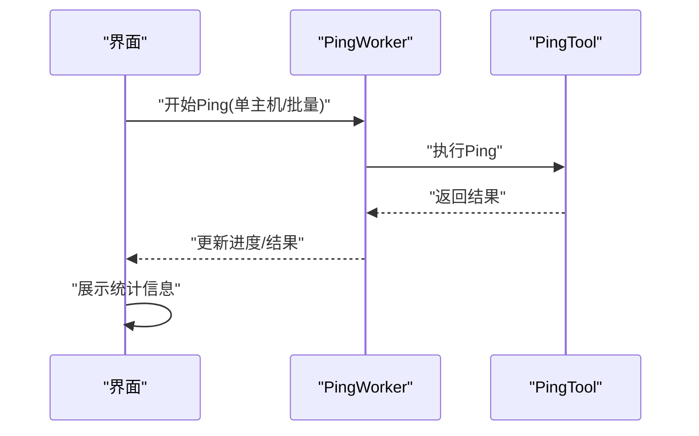
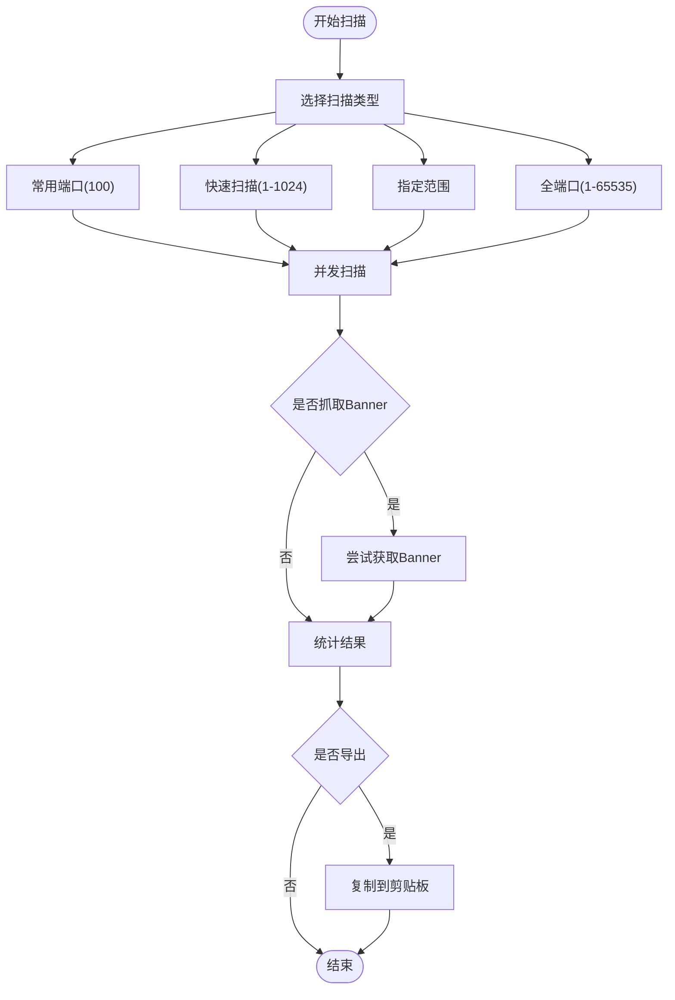
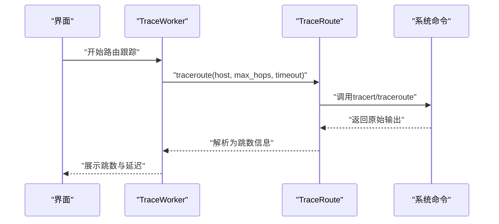
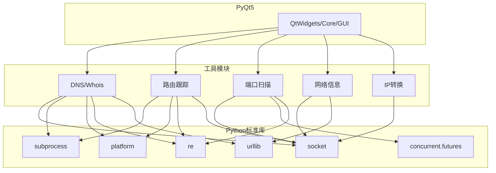

# 网络信息工具

<cite>
**本文档引用的文件**
- [README.md](file://README.md)
- [main.py](file://main.py)
- [gui/main_window.py](file://gui/main_window.py)
- [gui/tools_window.py](file://gui/tools_window.py)
- [utils/network_tools/__init__.py](file://utils/network_tools/__init__.py)
- [utils/network_tools/dns_tool.py](file://utils/network_tools/dns_tool.py)
- [utils/network_tools/trace_route.py](file://utils/network_tools/trace_route.py)
- [utils/network_tools/port_scanner.py](file://utils/network_tools/port_scanner.py)
- [data/command_reference.py](file://data/command_reference.py)
- [gui/tools/dns_tool.py](file://gui/tools/dns_tool.py)
- [gui/tools/subnet_tool.py](file://gui/tools/subnet_tool.py)
- [gui/tools/ping_tool.py](file://gui/tools/ping_tool.py)
- [gui/tools/port_tool.py](file://gui/tools/port_tool.py)
- [gui/tools/trace_tool.py](file://gui/tools/trace_tool.py)
</cite>

## 目录
1. [简介](#简介)
2. [项目结构](#项目结构)
3. [核心组件](#核心组件)
4. [架构概览](#架构概览)
5. [详细组件分析](#详细组件分析)
6. [依赖分析](#依赖分析)
7. [性能考虑](#性能考虑)
8. [故障排除指南](#故障排除指南)
9. [结论](#结论)
10. [附录](#附录)

## 简介
本项目是一个基于 Python + PyQt5 的网络运维工具集，提供完整的网络信息获取与分析能力，涵盖本机 IP 地址获取、网络接口信息查询、路由表查看、ARP 缓存管理以及网络连接状态检测等功能。工具支持 Windows、Linux 和 macOS 多平台，具备现代化的图形界面与丰富的网络诊断能力。

## 项目结构
项目采用模块化设计，主要目录与文件组织如下：
- 应用入口与主窗口：main.py、gui/main_window.py
- 网络工具箱：gui/tools_window.py
- 网络工具模块：utils/network_tools/（DNS/Whois、路由跟踪、端口扫描、IP 转换等）
- GUI 工具界面：gui/tools/（DNS 查询、子网计算器、Ping 测试、端口扫描、路由跟踪等）
- 命令参考与最佳实践：data/command_reference.py
- README 文档：README.md

**图表来源**
- [main.py:1-69](file://main.py#L1-L69)
- [gui/main_window.py:1-862](file://gui/main_window.py#L1-L862)
- [gui/tools_window.py:1-77](file://gui/tools_window.py#L1-L77)
- [utils/network_tools/__init__.py:1-23](file://utils/network_tools/__init__.py#L1-L23)
- [data/command_reference.py:1-377](file://data/command_reference.py#L1-L377)

**章节来源**
- [README.md:107-153](file://README.md#L107-L153)
- [main.py:25-69](file://main.py#L25-L69)
- [gui/main_window.py:144-475](file://gui/main_window.py#L144-L475)
- [gui/tools_window.py:28-77](file://gui/tools_window.py#L28-L77)

## 核心组件
- 网络信息工具：提供本机 IP、公网 IP、主机名、网络接口等信息获取与展示。
- DNS/Whois 工具：支持正向/反向 DNS 查询、多种记录类型查询、Whois 信息获取。
- 子网计算器：支持子网计算、子网划分、CIDR 转换、掩码速查表。
- Ping 测试：支持单主机与批量 Ping，统计丢包率与延迟。
- 端口扫描：支持常用端口、快速扫描、指定范围、全端口扫描，支持 Banner 抓取。
- 路由跟踪：跨平台 tracert/traceroute 支持，解析跳数与延迟。
- IP 地址转换：支持十进制、十六进制、二进制与 IP 地址互转。

**章节来源**
- [utils/network_tools/dns_tool.py:314-414](file://utils/network_tools/dns_tool.py#L314-L414)
- [utils/network_tools/dns_tool.py:15-170](file://utils/network_tools/dns_tool.py#L15-L170)
- [gui/tools/dns_tool.py:304-380](file://gui/tools/dns_tool.py#L304-L380)
- [gui/tools/subnet_tool.py:27-320](file://gui/tools/subnet_tool.py#L27-L320)
- [gui/tools/ping_tool.py:56-291](file://gui/tools/ping_tool.py#L56-L291)
- [utils/network_tools/port_scanner.py:14-315](file://utils/network_tools/port_scanner.py#L14-L315)
- [gui/tools/port_tool.py:64-527](file://gui/tools/port_tool.py#L64-L527)
- [utils/network_tools/trace_route.py:14-299](file://utils/network_tools/trace_route.py#L14-L299)
- [gui/tools/trace_tool.py:44-232](file://gui/tools/trace_tool.py#L44-L232)

## 架构概览
系统采用“主窗口 + 工具箱 + 工具模块”的三层架构：
- 主窗口负责设备品牌切换、配置生成与工具入口。
- 工具箱窗口提供统一的工具集合，按标签页组织。
- 工具模块封装具体网络功能，提供跨平台兼容实现。

**图表来源**
- [gui/main_window.py:339-475](file://gui/main_window.py#L339-L475)
- [gui/tools_window.py:58-72](file://gui/tools_window.py#L58-L72)
- [utils/network_tools/__init__.py:7-22](file://utils/network_tools/__init__.py#L7-L22)
- [data/command_reference.py:7-324](file://data/command_reference.py#L7-L324)

**章节来源**
- [gui/main_window.py:339-475](file://gui/main_window.py#L339-L475)
- [gui/tools_window.py:28-77](file://gui/tools_window.py#L28-L77)
- [utils/network_tools/__init__.py:1-23](file://utils/network_tools/__init__.py#L1-L23)

## 详细组件分析

### 网络信息工具（本机 IP、公网 IP、接口信息）
- 功能概述
  - 获取本机 IP 地址与主机名
  - 通过公网 IP 服务获取公网 IP
  - 获取网络接口列表与相关信息
- 实现要点
  - 使用套接字连接外部地址以获取本机 IP
  - 通过多个公网 IP 服务进行轮询，提升成功率
  - 解析主机名与 IP 映射，汇总接口信息
- 使用建议
  - 在受限网络环境中，公网 IP 获取可能失败，需检查网络代理与防火墙设置
  - 如需获取更详细的网络接口信息，可结合系统命令或第三方库

**图表来源**
- [utils/network_tools/dns_tool.py:314-378](file://utils/network_tools/dns_tool.py#L314-L378)

**章节来源**
- [utils/network_tools/dns_tool.py:314-414](file://utils/network_tools/dns_tool.py#L314-L414)
- [gui/tools/dns_tool.py:304-380](file://gui/tools/dns_tool.py#L304-L380)

### DNS/Whois 查询工具
- 功能概述
  - 正向 DNS 查询（A/AAAA/MX/NS/TXT/CNAME/SOA）
  - 反向 DNS 查询（IP → 域名）
  - Whois 域名注册信息查询
- 实现要点
  - 使用系统 nslookup 命令与正则表达式解析结果
  - 反向查询使用 socket.gethostbyaddr
  - Whois 查询通过 TCP 43 端口连接权威服务器
- 使用建议
  - 不同区域的 Whois 服务器不同，工具内置常见后缀的服务器映射
  - 查询超时与网络环境相关，必要时增加超时时间

**图表来源**
- [utils/network_tools/dns_tool.py:15-170](file://utils/network_tools/dns_tool.py#L15-L170)
- [utils/network_tools/dns_tool.py:207-312](file://utils/network_tools/dns_tool.py#L207-L312)

**章节来源**
- [utils/network_tools/dns_tool.py:15-170](file://utils/network_tools/dns_tool.py#L15-L170)
- [utils/network_tools/dns_tool.py:207-312](file://utils/network_tools/dns_tool.py#L207-L312)
- [gui/tools/dns_tool.py:27-302](file://gui/tools/dns_tool.py#L27-L302)

### 子网计算器
- 功能概述
  - 输入 IP 与掩码/前缀，计算网络地址、广播地址、可用主机数等
  - 支持子网划分与 CIDR 转换
  - 提供掩码速查表
- 实现要点
  - 将 IP 与掩码转换为二进制进行运算
  - 支持 IPv4 与二进制表示
  - 提供表格化展示与排序功能
- 使用建议
  - 注意私有地址段与保留地址的判断
  - 子网划分时确保新前缀大于原前缀

**图表来源**
- [gui/tools/subnet_tool.py:202-320](file://gui/tools/subnet_tool.py#L202-L320)

**章节来源**
- [gui/tools/subnet_tool.py:27-320](file://gui/tools/subnet_tool.py#L27-L320)

### Ping 测试工具
- 功能概述
  - 单主机 Ping 与批量 Ping
  - 统计发送包数、接收包数、丢包率、最小/最大/平均延迟
- 实现要点
  - 使用 QThread 异步执行，避免界面阻塞
  - 支持进度更新与结果回传
- 使用建议
  - 批量测试时合理设置超时时间，避免长时间等待
  - 对于网络不稳定环境，适当增加超时值

**图表来源**
- [gui/tools/ping_tool.py:28-54](file://gui/tools/ping_tool.py#L28-L54)
- [gui/tools/ping_tool.py:169-291](file://gui/tools/ping_tool.py#L169-L291)

**章节来源**
- [gui/tools/ping_tool.py:56-291](file://gui/tools/ping_tool.py#L56-L291)

### 端口扫描工具
- 功能概述
  - 常用端口扫描、快速扫描、指定范围扫描、全端口扫描
  - 支持 Banner 抓取与服务识别
  - 提供批量端口检测与结果导出
- 实现要点
  - 使用线程池并发扫描，提升效率
  - 支持进度回调与实时统计
- 使用建议
  - 扫描全端口耗时较长，建议根据需求选择扫描范围
  - 注意扫描频率与目标主机的防护策略

**图表来源**
- [gui/tools/port_tool.py:28-62](file://gui/tools/port_tool.py#L28-L62)
- [utils/network_tools/port_scanner.py:120-196](file://utils/network_tools/port_scanner.py#L120-L196)

**章节来源**
- [utils/network_tools/port_scanner.py:14-315](file://utils/network_tools/port_scanner.py#L14-L315)
- [gui/tools/port_tool.py:64-527](file://gui/tools/port_tool.py#L64-L527)

### 路由跟踪工具
- 功能概述
  - 跨平台路由跟踪（Windows tracert、Linux traceroute/tracepath）
  - 解析跳数、IP、平均延迟与超时状态
- 实现要点
  - 自动识别操作系统并调用相应命令
  - 解析不同平台的输出格式，提取关键信息
- 使用建议
  - 路由跟踪可能受中间设备限制，部分跳数可能显示超时
  - 调整最大跳数与超时时间以获得更准确结果

**图表来源**
- [gui/tools/trace_tool.py:27-42](file://gui/tools/trace_tool.py#L27-L42)
- [utils/network_tools/trace_route.py:18-77](file://utils/network_tools/trace_route.py#L18-L77)

**章节来源**
- [utils/network_tools/trace_route.py:14-299](file://utils/network_tools/trace_route.py#L14-L299)
- [gui/tools/trace_tool.py:44-232](file://gui/tools/trace_tool.py#L44-L232)

## 依赖分析
- 模块依赖
  - 主窗口依赖工具箱窗口与样式模块
  - 工具箱窗口依赖各工具界面与样式模块
  - 工具界面依赖对应的工具模块与样式模块
- 外部依赖
  - Python 标准库：socket、subprocess、platform、re、concurrent.futures、urllib 等
  - PyQt5：用于图形界面构建
- 平台兼容性
  - Windows：使用 tracert、nslookup、socket
  - Linux：使用 traceroute/tracepath、nslookup、socket
  - macOS：使用 traceroute/tracepath、nslookup、socket

**图表来源**
- [utils/network_tools/dns_tool.py:7-12](file://utils/network_tools/dns_tool.py#L7-L12)
- [utils/network_tools/trace_route.py:7-11](file://utils/network_tools/trace_route.py#L7-L11)
- [utils/network_tools/port_scanner.py:7-11](file://utils/network_tools/port_scanner.py#L7-L11)
- [utils/network_tools/dns_tool.py:355-377](file://utils/network_tools/dns_tool.py#L355-L377)

**章节来源**
- [utils/network_tools/dns_tool.py:7-12](file://utils/network_tools/dns_tool.py#L7-L12)
- [utils/network_tools/trace_route.py:7-11](file://utils/network_tools/trace_route.py#L7-L11)
- [utils/network_tools/port_scanner.py:7-11](file://utils/network_tools/port_scanner.py#L7-L11)

## 性能考虑
- 并发与异步
  - 端口扫描使用线程池并发，提升扫描速度
  - Ping 与路由跟踪使用 QThread 异步执行，避免界面卡顿
- 资源管理
  - 合理设置超时时间，避免长时间阻塞
  - 扫描全端口时建议限制并发数量，防止资源耗尽
- 输出解析
  - 使用正则表达式解析系统命令输出，注意不同平台格式差异
  - 对于大量数据的表格展示，建议分页或虚拟滚动

## 故障排除指南
- 权限与防火墙
  - 部分网络诊断工具需要管理员权限或系统命令支持
  - 防火墙可能阻止某些扫描或查询，需临时放行或调整规则
- 超时与网络不稳定
  - 增加超时时间或减少并发数量
  - 对于公网 IP 获取失败，尝试更换服务或检查代理设置
- 平台差异
  - 不同操作系统的命令行工具输出格式不同，工具已做兼容处理
  - 如遇解析错误，可开启原始输出查看详细信息
- 端口扫描风险
  - 避免对生产环境进行全端口扫描
  - 遵守目标网络的使用政策与法律法规

**章节来源**
- [gui/tools/port_tool.py:428-435](file://gui/tools/port_tool.py#L428-L435)
- [gui/tools/trace_tool.py:216-224](file://gui/tools/trace_tool.py#L216-L224)
- [utils/network_tools/trace_route.py:80-124](file://utils/network_tools/trace_route.py#L80-L124)

## 结论
本网络信息工具集提供了从基础网络信息获取到高级网络诊断的完整解决方案，具备良好的跨平台兼容性与用户体验。通过模块化的架构设计与丰富的工具集合，能够满足日常网络运维与故障排查的需求。建议在使用过程中结合系统命令参考与最佳实践，确保操作的安全性与准确性。

## 附录
- 系统要求
  - Python 3.8+
  - PyQt5
  - Windows/Linux/macOS
- 安装与运行
  - pip install PyQt5
  - python main.py 或双击 run.bat
- 命令参考与最佳实践
  - 内置华为/H3C/锐捷/迈普命令参考与安全基线建议

**章节来源**
- [README.md:81-99](file://README.md#L81-L99)
- [README.md:193-198](file://README.md#L193-L198)
- [data/command_reference.py:327-377](file://data/command_reference.py#L327-L377)