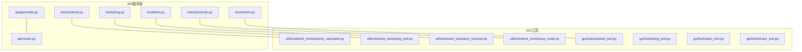
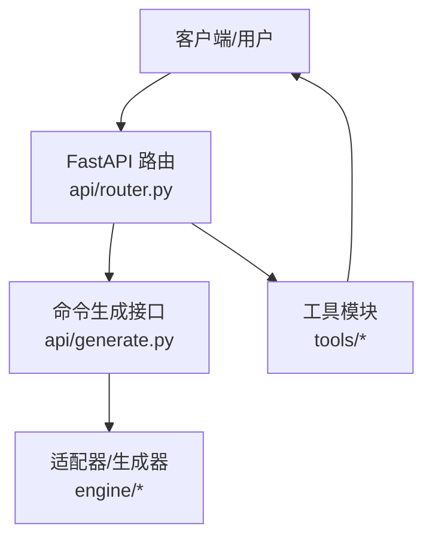
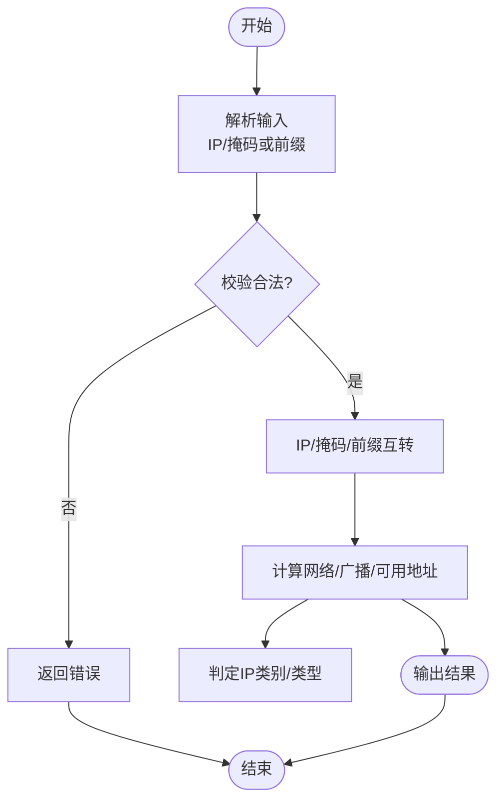
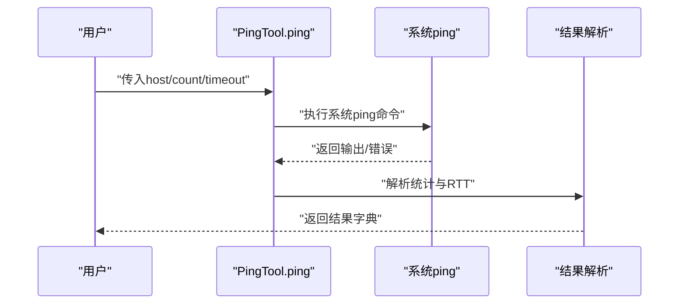
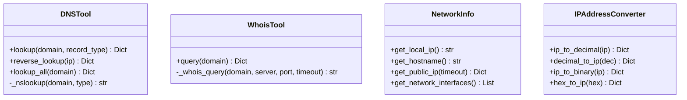
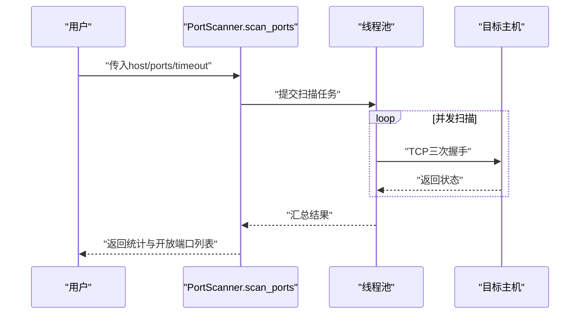
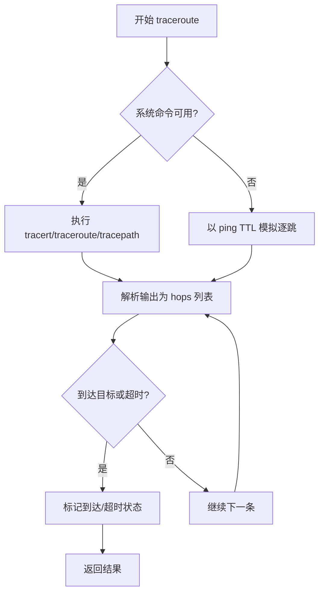
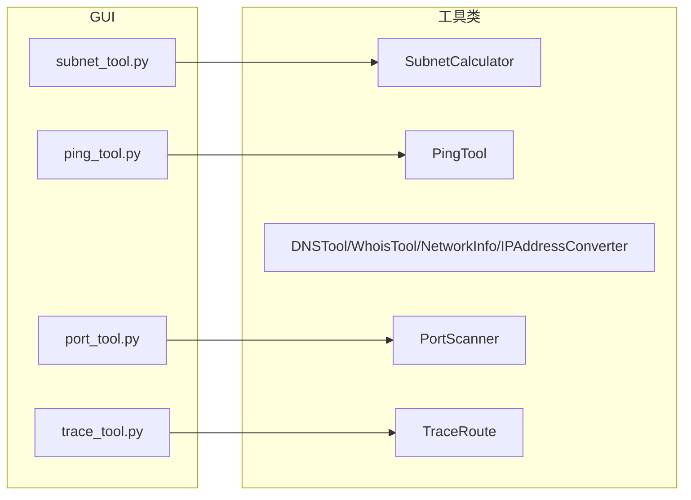

# 网络工具模块

<cite>
**本文引用的文件**
- [subnet.py](file://api/app/tools/subnet.py)
- [ping.py](file://api/app/tools/ping.py)
- [dns.py](file://api/app/tools/dns.py)
- [portscan.py](file://api/app/tools/portscan.py)
- [trace.py](file://api/app/tools/trace.py)
- [subnet_calculator.py](file://opensource/NetOps-toolkit/utils/network_tools/subnet_calculator.py)
- [ping_tool.py](file://opensource/NetOps-toolkit/utils/network_tools/ping_tool.py)
- [port_scanner.py](file://opensource/NetOps-toolkit/utils/network_tools/port_scanner.py)
- [trace_route.py](file://opensource/NetOps-toolkit/utils/network_tools/trace_route.py)
- [subnet_tool.py](file://opensource/NetOps-toolkit/gui/tools/subnet_tool.py)
- [ping_tool.py](file://opensource/NetOps-toolkit/gui/tools/ping_tool.py)
- [port_tool.py](file://opensource/NetOps-toolkit/gui/tools/port_tool.py)
- [trace_tool.py](file://opensource/NetOps-toolkit/gui/tools/trace_tool.py)
- [generate.py](file://api/app/api/generate.py)
- [router.py](file://api/app/api/router.py)
</cite>

## 目录
1. [简介](#简介)
2. [项目结构](#项目结构)
3. [核心组件](#核心组件)
4. [架构概览](#架构概览)
5. [详细组件分析](#详细组件分析)
6. [依赖分析](#依赖分析)
7. [性能考虑](#性能考虑)
8. [故障排查指南](#故障排查指南)
9. [结论](#结论)
10. [附录](#附录)

## 简介
本指南面向网络工程师与运维人员，系统讲解网络工具模块的五大核心能力：子网计算、Ping连通性测试、Traceroute路由跟踪、端口扫描、DNS查询。文档覆盖各工具的算法原理、输入参数、输出格式、使用场景、性能特征、限制条件与最佳实践，并提供基于GUI与API两种形态的实操指引与排障建议。

## 项目结构
该仓库包含两套实现：
- API服务端实现：位于 api/app/tools，提供可直接调用的Python工具类，以及FastAPI路由与生成器接口。
- GUI工具实现：位于 opensource/NetOps-toolkit，提供PyQt5图形界面，封装上述工具类用于交互式使用。

图表来源
- [generate.py:1-77](file://api/app/api/generate.py#L1-L77)
- [router.py:1-10](file://api/app/api/router.py#L1-L10)

章节来源
- [generate.py:1-77](file://api/app/api/generate.py#L1-L77)
- [router.py:1-10](file://api/app/api/router.py#L1-L10)

## 核心组件
- 子网计算器：支持IP/掩码互转、前缀长度换算、网络/广播/可用地址计算、子网划分、CIDR合并、掩码速查。
- Ping工具：跨平台执行系统ping命令，解析统计与RTT，支持批量与网段扫描。
- DNS工具：封装socket与nslookup，支持A/AAAA/MX/NS/TXT/CNAME等记录查询、反向查询、Whois简化查询、本地网络信息。
- 端口扫描器：TCP三次握手探测，Banner抓取，多策略扫描（常用端口、快速范围、全端口），进度回调。
- Traceroute：优先调用系统tracert/traceroute/tracepath，失败时以ping TTL模拟近似路径。

章节来源
- [subnet.py:1-280](file://api/app/tools/subnet.py#L1-L280)
- [ping.py:1-241](file://api/app/tools/ping.py#L1-L241)
- [dns.py:1-502](file://api/app/tools/dns.py#L1-L502)
- [portscan.py:1-315](file://api/app/tools/portscan.py#L1-L315)
- [trace.py:1-299](file://api/app/tools/trace.py#L1-L299)

## 架构概览
API层通过FastAPI路由聚合，将工具模块与命令生成引擎对接；GUI层通过PyQt5封装工具类，提供可视化交互。

图表来源
- [router.py:1-10](file://api/app/api/router.py#L1-L10)
- [generate.py:1-77](file://api/app/api/generate.py#L1-L77)

## 详细组件分析

### 子网计算器
- 功能要点
  - IP与整数互转、掩码与前缀互转、网络/广播/通配符掩码计算。
  - IP类别与类型判定（A/B/C/D/E、私有/公网/环回/组播/保留）。
  - 子网划分：按新前缀切分子网，返回每段的首/末主机与广播。
  - CIDR合并：将连续IP范围归并为最小CIDR块集合。
  - 掩码速查：列出0–32前缀对应的掩码、总主机数与可用主机数。
- 输入参数
  - calculate(ip, mask_or_prefix)
  - split_subnet(network, prefix, new_prefix)
  - ip_range_to_cidr(start_ip, end_ip)
- 输出格式
  - 字典字段包含：success/error/ip_address/subnet_mask/prefix_length/network_address/broadcast_address/first_usable/last_usable/total_hosts/usable_hosts/wildcard_mask/ip_class/ip_type/is_private/binary_ip/binary_mask。
  - 子网划分返回列表，每项含subnet/prefix/mask/first_host/last_host/broadcast/hosts。
  - CIDR合并返回列表，每项含network/prefix/cidr/mask/broadcast。
- 算法复杂度
  - 计算与CIDR合并：O(1)与O(n)混合，n为范围长度；合并过程按位运算与贪心选择。
  - 子网划分：O(2^(new_prefix-prefix))。
- 使用场景
  - 规划VLAN/子网、验证ACL/路由策略、网络设计与审计。
- 最佳实践
  - 优先使用CIDR输入，避免掩码字符串格式不一致。
  - 大规模合并建议先排序再处理，减少重叠判断开销。
- 故障排查
  - 输入非法IP/掩码会返回error字段；前缀越界或掩码无效将报错。

图表来源
- [subnet.py:50-166](file://api/app/tools/subnet.py#L50-L166)

章节来源
- [subnet.py:1-280](file://api/app/tools/subnet.py#L1-L280)
- [subnet_calculator.py:1-280](file://opensource/NetOps-toolkit/utils/network_tools/subnet_calculator.py#L1-L280)
- [subnet_tool.py:1-320](file://opensource/NetOps-toolkit/gui/tools/subnet_tool.py#L1-L320)

### Ping测试
- 功能要点
  - 跨平台执行系统ping命令，解析发送/接收/丢包率/最小/最大/平均RTT。
  - 支持批量Ping与网段扫描（按前缀生成主机列表并发探测）。
- 输入参数
  - ping(host, count, timeout)
  - ping_list(hosts, count, timeout, max_workers)
  - ping_sweep(network, prefix, timeout, max_workers)
- 输出格式
  - 字典字段：success/host/packets_sent/packets_received/packets_lost/loss_rate/min_time/max_time/avg_time/ip_address/error/raw_output。
- 算法与实现
  - 使用subprocess调用系统命令，正则匹配不同平台输出差异。
  - 批量/扫描采用ThreadPoolExecutor并发，控制最大并发数。
- 使用场景
  - 连通性快速验证、设备存活清单、网络抖动评估。
- 最佳实践
  - 合理设置count与timeout，避免过长等待；高并发时降低count。
  - Windows/Linux输出差异已内置兼容，无需手动区分。
- 故障排查
  - 无法解析主机名、Ping命令未找到、超时等均有明确错误提示。

图表来源
- [ping.py:18-171](file://api/app/tools/ping.py#L18-L171)

章节来源
- [ping.py:1-241](file://api/app/tools/ping.py#L1-L241)
- [ping_tool.py:1-241](file://opensource/NetOps-toolkit/utils/network_tools/ping_tool.py#L1-L241)
- [ping_tool.py:1-291](file://opensource/NetOps-toolkit/gui/tools/ping_tool.py#L1-L291)

### DNS查询
- 功能要点
  - A/AAAA记录解析；MX/NS/TXT/CNAME等记录查询；反向DNS查询（IP→域名）。
  - Whois简化查询（按域名后缀选择WHOIS服务器）。
  - 本地网络信息：本机IP/主机名、公网IP探测、网络接口枚举。
  - IP地址转换：十进制/十六进制/二进制互转。
- 输入参数
  - lookup(domain, record_type)
  - reverse_lookup(ip)
  - WhoisTool.query(domain)
  - NetworkInfo.get_public_ip(timeout)
  - IPAddressConverter.ip_to_decimal/ip_to_binary/decimal_to_ip/hex_to_ip
- 输出格式
  - lookup：success/domain/record_type/records/error/query_time。
  - reverse_lookup：success/ip/hostname/aliases/error。
  - WhoisTool：success/domain/registrar/creation_date/expiration_date/name_servers/status/raw_output/error。
  - NetworkInfo：get_local_ip/get_hostname/get_public_ip/get_network_interfaces。
  - 转换工具：success/ip/decimal/hex/binary/error。
- 算法与实现
  - A/AAAA使用socket.getaddrinfo；其他记录通过nslookup子进程执行。
  - 反向查询使用socket.gethostbyaddr；Whois直连IANA或特定后缀服务器。
  - 公网IP通过多个公共API轮询获取。
- 使用场景
  - 域名解析验证、邮件服务器配置核对、网络定位与溯源。
- 最佳实践
  - 对MX/NS/TXT等记录查询失败时，检查DNS权威服务器可达性。
  - Whois查询可能受限于隐私保护，结果仅供参考。
- 故障排查
  - DNS解析失败、反向查询失败、Whois连接超时均有明确错误信息。

图表来源
- [dns.py:15-502](file://api/app/tools/dns.py#L15-L502)

章节来源
- [dns.py:1-502](file://api/app/tools/dns.py#L1-L502)

### 端口扫描
- 功能要点
  - 单端口测试、常用端口扫描、指定范围扫描、全端口扫描。
  - Banner抓取（部分协议），进度回调，统计开放/关闭/过滤端口数量。
- 输入参数
  - scan_port(host, port, timeout)
  - scan_common_ports(host, timeout)
  - scan_port_range(host, start_port, end_port, timeout, max_workers, progress_callback)
  - scan_full_range(host, timeout, max_workers, progress_callback)
  - test_port(host, port, timeout)
  - is_port_open(host, port, timeout)
  - tcp_connect_test(host, port, timeout)
- 输出格式
  - scan_port：port/status/service/banner/error。
  - scan_ports：success/host/start_time/end_time/total_ports/open_ports/closed_ports/filtered_ports/ports/error。
  - test_port：host/port/status/open/service/banner。
  - tcp_connect_test：(success, message)。
- 算法与实现
  - TCP三次握手探测，非阻塞连接；对HTTP类端口尝试发送HEAD请求以抓取Banner。
  - 多线程并发，合理设置max_workers避免资源耗尽。
- 使用场景
  - 安全基线核查、服务暴露面盘点、端口异常告警。
- 最佳实践
  - 合理设置timeout与max_workers；对高并发扫描建议分批进行。
  - 注意防火墙/IDS拦截导致的“过滤”误判。
- 故障排查
  - 超时/连接被拒/无法解析主机名均有明确状态与错误信息。

图表来源
- [portscan.py:120-196](file://api/app/tools/portscan.py#L120-L196)

章节来源
- [portscan.py:1-315](file://api/app/tools/portscan.py#L1-L315)
- [port_scanner.py:1-315](file://opensource/NetOps-toolkit/utils/network_tools/port_scanner.py#L1-L315)
- [port_tool.py:1-527](file://opensource/NetOps-toolkit/gui/tools/port_tool.py#L1-L527)

### Traceroute路由跟踪
- 功能要点
  - 跨平台调用tracert/traceroute/tracepath，解析跳点IP、RTT、到达状态。
  - 解析失败时以ping TTL模拟近似路径。
  - 支持并行跟踪多个主机。
- 输入参数
  - traceroute(host, max_hops, timeout)
  - trace_parallel(hosts, max_hops, timeout, max_workers)
- 输出格式
  - success/host/ip_address/hops/total_hops/reached_destination/error/raw_output。
  - hops为列表，每项含hop_number/ip/hostname/rtt_times/avg_rtt/timeout/reached。
- 算法与实现
  - 优先系统命令；失败回退到ping TTL逐跳探测。
  - 正则解析不同平台输出，兼容中文/英文提示。
- 使用场景
  - 网络路径诊断、跨境/跨域链路质量评估、故障定位。
- 最佳实践
  - 合理设置max_hops与timeout；对复杂网络可多次运行取平均。
  - 注意中间设备可能禁用ICMP/Traceroute，出现大量“*”。
- 故障排查
  - 无法解析主机名、命令未找到、超时均返回相应错误。

图表来源
- [trace.py:17-77](file://api/app/tools/trace.py#L17-L77)

章节来源
- [trace.py:1-299](file://api/app/tools/trace.py#L1-L299)
- [trace_route.py:1-299](file://opensource/NetOps-toolkit/utils/network_tools/trace_route.py#L1-L299)
- [trace_tool.py:1-232](file://opensource/NetOps-toolkit/gui/tools/trace_tool.py#L1-L232)

## 依赖分析
- 内部依赖
  - 工具类彼此独立，无循环依赖。
  - GUI工具依赖对应utils/network_tools中的工具类。
- 外部依赖
  - API工具类主要依赖标准库（socket、subprocess、re、concurrent.futures等）。
  - GUI工具额外依赖PyQt5与样式模块。
- 路由与生成器
  - FastAPI路由聚合tools与generate接口，统一对外提供REST服务。

图表来源
- [subnet_tool.py:1-320](file://opensource/NetOps-toolkit/gui/tools/subnet_tool.py#L1-L320)
- [ping_tool.py:1-291](file://opensource/NetOps-toolkit/gui/tools/ping_tool.py#L1-L291)
- [port_tool.py:1-527](file://opensource/NetOps-toolkit/gui/tools/port_tool.py#L1-L527)
- [trace_tool.py:1-232](file://opensource/NetOps-toolkit/gui/tools/trace_tool.py#L1-L232)

章节来源
- [router.py:1-10](file://api/app/api/router.py#L1-L10)
- [generate.py:1-77](file://api/app/api/generate.py#L1-L77)

## 性能考虑
- 并发与资源
  - Ping/端口扫描/Traceroute均支持线程池并发，需根据目标数量与网络状况调整max_workers，避免系统资源耗尽。
- I/O与解析
  - 子网计算为纯CPU计算，复杂度低；CIDR合并与子网划分受输入规模影响。
  - DNS查询与Whois查询受外部服务器响应影响，建议设置合理timeout并做重试。
- 精度与稳定性
  - Traceroute解析依赖系统命令输出，不同平台/版本存在差异，代码已内置多模式解析与回退逻辑。
- 建议
  - 在生产环境使用前进行压力测试，结合业务峰值设定并发上限。
  - 对高风险扫描（如全端口）建议在维护窗口执行并做好审计日志。

## 故障排查指南
- 子网计算
  - 现象：返回error；原因：IP格式/掩码/前缀不合法。
  - 处理：检查输入格式，确保掩码为标准点分十进制或0–32的前缀。
- Ping
  - 现象：无法解析主机名/Ping超时/命令未找到。
  - 处理：确认DNS可达、系统ping命令存在、参数合理。
- DNS
  - 现象：查询失败/反向查询失败/Whois超时。
  - 处理：更换DNS服务器、检查网络策略、适当增加timeout。
- 端口扫描
  - 现象：大量“过滤”/超时。
  - 处理：降低并发、增大timeout、检查防火墙/IDS策略。
- Traceroute
  - 现象：大量“*”或未到达目标。
  - 处理：提高max_hops与timeout，确认中间设备允许追踪。

章节来源
- [subnet.py:82-103](file://api/app/tools/subnet.py#L82-L103)
- [ping.py:164-170](file://api/app/tools/ping.py#L164-L170)
- [dns.py:55-56](file://api/app/tools/dns.py#L55-L56)
- [portscan.py:75-87](file://api/app/tools/portscan.py#L75-L87)
- [trace.py:99-102](file://api/app/tools/trace.py#L99-L102)

## 结论
本网络工具模块提供了从基础子网规划到连通性、解析、暴露面与路径诊断的完整能力。API与GUI双通道满足不同使用场景，具备良好的跨平台兼容性与扩展性。建议在网络变更前后使用子网计算与Traceroute进行验证，结合Ping与端口扫描进行健康度巡检，并通过DNS工具核对域名与服务配置。

## 附录
- 实际使用建议
  - 子网规划：先用CIDR合并与子网划分工具生成设计方案，再用计算工具校验边界。
  - 连通性巡检：定期批量Ping关键节点，记录丢包率与RTT趋势。
  - 安全审计：扫描常用端口与高危端口，结合Banner识别服务版本。
  - 路径诊断：对跨域/跨境链路，多时段多次追踪，关注抖动与丢包。
- 常见问题
  - 为什么Traceroute显示大量“*”？中间设备可能禁用了ICMP/Traceroute。
  - 为什么端口扫描显示“过滤”？防火墙/IDS拦截或目标系统策略限制。
  - 为什么DNS查询失败？DNS服务器不可达或记录不存在。