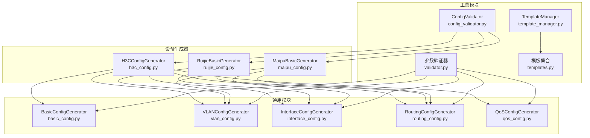
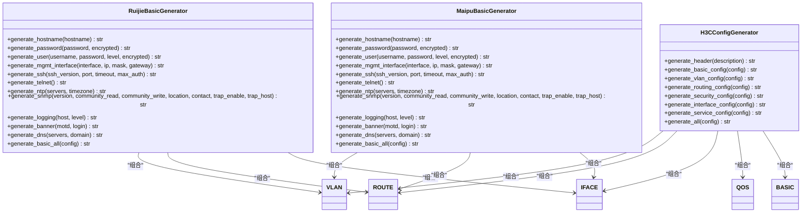
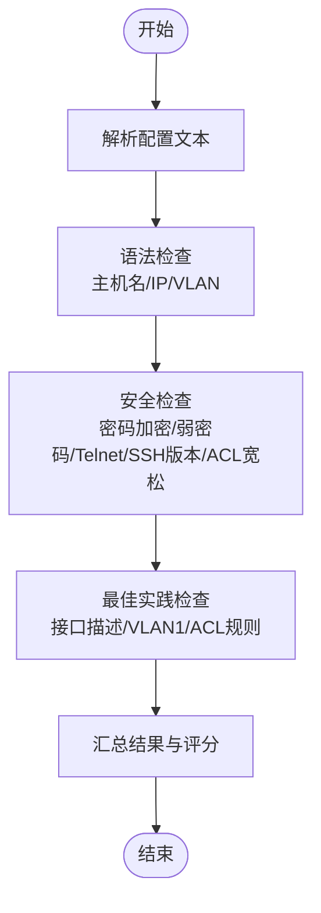
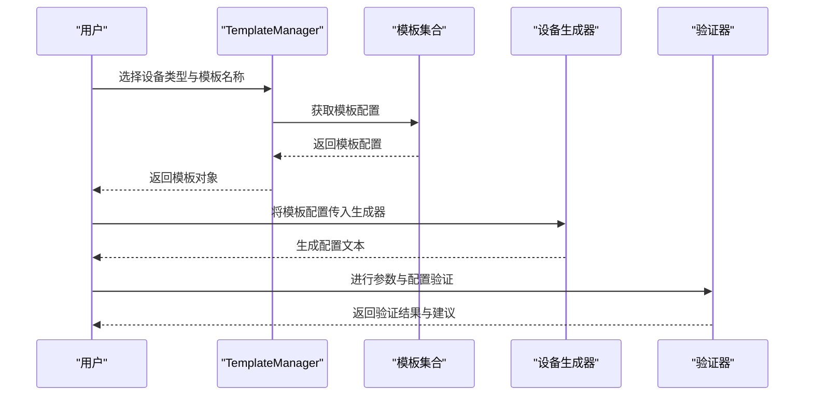
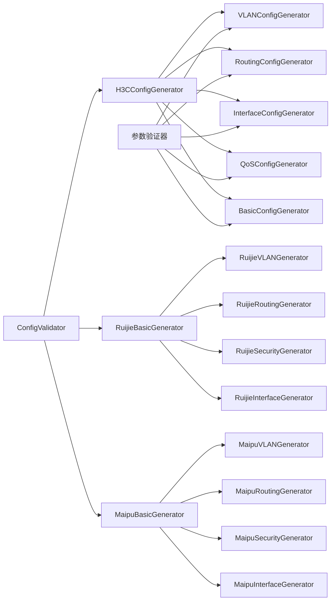

# 设备特定配置API

<cite>
**本文引用的文件**
- [h3c_config.py](file://opensource/NetOps-toolkit/modules/h3c_config.py)
- [ruijie_config.py](file://opensource/NetOps-toolkit/modules/ruijie_config.py)
- [maipu_config.py](file://opensource/NetOps-toolkit/modules/maipu_config.py)
- [config_validator.py](file://opensource/NetOps-toolkit/utils/config_validator.py)
- [validator.py](file://opensource/NetOps-toolkit/utils/validator.py)
- [template_manager.py](file://opensource/NetOps-toolkit/utils/template_manager.py)
- [templates.py](file://opensource/NetOps-toolkit/utils/templates.py)
- [basic_config.py](file://opensource/NetOps-toolkit/modules/basic_config.py)
- [interface_config.py](file://opensource/NetOps-toolkit/modules/interface_config.py)
- [qos_config.py](file://opensource/NetOps-toolkit/modules/qos_config.py)
- [vlan_config.py](file://opensource/NetOps-toolkit/modules/vlan_config.py)
- [routing_config.py](file://opensource/NetOps-toolkit/modules/routing_config.py)
</cite>

## 目录
1. [简介](#简介)
2. [项目结构](#项目结构)
3. [核心组件](#核心组件)
4. [架构总览](#架构总览)
5. [详细组件分析](#详细组件分析)
6. [依赖分析](#依赖分析)
7. [性能考虑](#性能考虑)
8. [故障排查指南](#故障排查指南)
9. [结论](#结论)
10. [附录](#附录)

## 简介
本文件为“设备特定配置生成器”的API参考文档，聚焦于H3C、锐捷、迈普三大厂商的配置生成器类及其配套验证与模板工具。内容涵盖：
- 每个设备生成器类的方法签名、参数说明、返回值与典型用法
- 不同设备品牌在命令风格、参数命名与功能支持上的差异
- 参数验证规则与错误处理机制
- 完整配置模板结构与生成规则

## 项目结构
围绕设备特定配置生成器，项目采用按功能域分模块的组织方式：
- 设备生成器：H3C、锐捷、迈普分别提供独立模块，负责生成对应厂商的CLI配置
- 通用模块：基础配置、VLAN、接口、路由、QoS等模块提供通用能力
- 工具模块：配置验证器、参数验证器、模板管理器与模板集合

图表来源
- [h3c_config.py:11-594](file://opensource/NetOps-toolkit/modules/h3c_config.py#L11-L594)
- [ruijie_config.py:8-452](file://opensource/NetOps-toolkit/modules/ruijie_config.py#L8-L452)
- [maipu_config.py:8-454](file://opensource/NetOps-toolkit/modules/maipu_config.py#L8-L454)
- [basic_config.py:8-359](file://opensource/NetOps-toolkit/modules/basic_config.py#L8-L359)
- [vlan_config.py:8-175](file://opensource/NetOps-toolkit/modules/vlan_config.py#L8-L175)
- [interface_config.py:8-308](file://opensource/NetOps-toolkit/modules/interface_config.py#L8-L308)
- [routing_config.py:8-213](file://opensource/NetOps-toolkit/modules/routing_config.py#L8-L213)
- [qos_config.py:8-290](file://opensource/NetOps-toolkit/modules/qos_config.py#L8-L290)
- [config_validator.py:22-295](file://opensource/NetOps-toolkit/utils/config_validator.py#L22-L295)
- [validator.py:11-208](file://opensource/NetOps-toolkit/utils/validator.py#L11-L208)
- [template_manager.py:59-396](file://opensource/NetOps-toolkit/utils/template_manager.py#L59-L396)
- [templates.py:7-323](file://opensource/NetOps-toolkit/utils/templates.py#L7-L323)

章节来源
- [h3c_config.py:11-594](file://opensource/NetOps-toolkit/modules/h3c_config.py#L11-L594)
- [ruijie_config.py:8-452](file://opensource/NetOps-toolkit/modules/ruijie_config.py#L8-L452)
- [maipu_config.py:8-454](file://opensource/NetOps-toolkit/modules/maipu_config.py#L8-L454)

## 核心组件
本节对三大设备生成器类进行概览式介绍，并指出其与通用模块的关系。

- H3CConfigGenerator
  - 负责生成H3C设备的完整配置，包括基础、VLAN、路由、安全、接口、服务等模块
  - 提供统一入口生成完整配置（包含头部注释）
- RuijieBasicGenerator
  - 提供锐捷设备的基础配置生成能力，包含主机名、密码、用户、管理接口、SSH/Telnet、NTP、SNMP、日志、Banner、DNS等
  - 同时提供VLAN、路由、安全、接口等专用生成器
- MaipuBasicGenerator
  - 提供迈普设备的基础配置生成能力，命令风格与锐捷接近但存在细节差异
  - 同时提供VLAN、路由、安全、接口等专用生成器

章节来源
- [h3c_config.py:11-594](file://opensource/NetOps-toolkit/modules/h3c_config.py#L11-L594)
- [ruijie_config.py:8-452](file://opensource/NetOps-toolkit/modules/ruijie_config.py#L8-L452)
- [maipu_config.py:8-454](file://opensource/NetOps-toolkit/modules/maipu_config.py#L8-L454)

## 架构总览
设备特定配置生成器通过“模块化”和“组合式”设计实现：
- 每个设备生成器内部封装若干子模块（如基础、VLAN、路由、安全、接口、服务），形成“完整配置”生成流程
- 通用模块提供跨设备的标准化能力，便于在不同设备间复用
- 工具模块提供配置校验与模板管理，保障生成配置的质量与可维护性

图表来源
- [h3c_config.py:11-594](file://opensource/NetOps-toolkit/modules/h3c_config.py#L11-L594)
- [ruijie_config.py:8-452](file://opensource/NetOps-toolkit/modules/ruijie_config.py#L8-L452)
- [maipu_config.py:8-454](file://opensource/NetOps-toolkit/modules/maipu_config.py#L8-L454)

## 详细组件分析

### H3CConfigGenerator API参考
- 生成器职责
  - 生成H3C设备的完整配置，包含头部注释、基础配置、VLAN、路由、安全、接口、服务等模块
- 方法清单与说明
  - generate_header(description: str) -> str
    - 生成配置头部注释，包含设备品牌、生成时间、描述等
    - 典型用法：作为完整配置的首段
  - generate_basic_config(config: Dict) -> str
    - 生成基础配置，支持主机名、密码、管理接口、SSH、Telnet、用户、Banner、DNS、NTP、SNMP、日志等
    - 关键参数要点
      - password.value: 密码值；encrypted: 是否加密存储
      - mgmt_interface.interface/ip_address/mask/gateway: 管理接口IP与默认路由
      - enable_ssh/enable_telnet: 控制启用SSH或Telnet
      - ssh/ssh_user: SSH服务器参数与本地用户
      - user: 本地用户配置（用户名、密码、权限级别、服务类型）
    - 返回值：基础配置片段字符串
  - generate_vlan_config(config: Dict) -> str
    - 生成VLAN配置，支持批量VLAN、接口VLAN（access/trunk/hybrid）、VLANIF、STP
    - 关键参数要点
      - vlans: 列表，每项含id/name
      - interfaces: 列表，每项含interface/link_type/vlan_id/pvid/trunk_vlans/untagged/tagged
      - vlanifs: 列表，每项含vlan_id/ip_address/mask/description
      - stp.enable/mode/priority: STP开关、模式与优先级
  - generate_routing_config(config: Dict) -> str
    - 生成路由配置，支持静态路由、默认路由、OSPF、BGP、RIP
    - 关键参数要点
      - static: 列表，每项含destination/mask/next_hop/preference
      - default: 包含next_hop/preference
      - ospf: process_id/router_id/area_id/networks
      - bgp: as_number/router_id/neighbors/networks
  - generate_security_config(config: Dict) -> str
    - 生成安全配置，支持ACL、端口安全、MAC绑定、ARP防护
    - 关键参数要点
      - acls: 列表，每项含number/rules；规则含action/source/destination/port/protocol
      - port_security: 列表，每项含interface/max_mac/violation
      - mac_binding: 列表，每项含mac/interface/vlan
      - arp_protection.enable/static_entries: ARP防护与静态条目
  - generate_interface_config(config: Dict) -> str
    - 生成接口高级配置，支持Eth-Trunk、LLDP、速率限制
    - 关键参数要点
      - eth_trunks: 列表，每项含trunk_id/mode/member_ports/link_type/trunk_vlans
      - lldp.enable/mode: LLDP开关与工作模式
      - rate_limit: 列表，每项含interface/cir/cbs
  - generate_service_config(config: Dict) -> str
    - 生成系统服务配置，支持NTP、SNMP、日志
    - 关键参数要点
      - ntp.servers/timezone: NTP服务器与时区
      - snmp.version/community_read/community_write/trap_enable/trap_host
      - log.host/log_level
  - generate_all(config: Dict) -> str
    - 组合生成完整配置，包含头部、基础、VLAN、路由、安全、接口、服务等
    - 关键参数要点
      - config.basic/vlan/routing/security/interface/service
      - description: 传入头部描述

- 使用示例（路径）
  - [H3C基础配置示例:26-125](file://opensource/NetOps-toolkit/modules/h3c_config.py#L26-L125)
  - [H3C VLAN配置示例:129-227](file://opensource/NetOps-toolkit/modules/h3c_config.py#L129-L227)
  - [H3C路由配置示例:231-319](file://opensource/NetOps-toolkit/modules/h3c_config.py#L231-L319)
  - [H3C安全配置示例:323-415](file://opensource/NetOps-toolkit/modules/h3c_config.py#L323-L415)
  - [H3C接口配置示例:421-480](file://opensource/NetOps-toolkit/modules/h3c_config.py#L421-L480)
  - [H3C服务配置示例:485-548](file://opensource/NetOps-toolkit/modules/h3c_config.py#L485-L548)
  - [H3C完整配置示例:551-593](file://opensource/NetOps-toolkit/modules/h3c_config.py#L551-L593)

- 参数验证与错误处理
  - 内置验证：H3C生成器内部对关键字段进行存在性与格式检查（如接口名、VLAN ID、IP地址等）
  - 外部验证：结合通用验证器与配置验证器进行更全面的校验与建议

章节来源
- [h3c_config.py:11-594](file://opensource/NetOps-toolkit/modules/h3c_config.py#L11-L594)
- [validator.py:11-208](file://opensource/NetOps-toolkit/utils/validator.py#L11-L208)
- [config_validator.py:22-295](file://opensource/NetOps-toolkit/utils/config_validator.py#L22-L295)

### 锐捷设备生成器API参考
- 生成器职责
  - 提供锐捷设备的基础配置生成器（RuijieBasicGenerator），以及VLAN、路由、安全、接口等专用生成器
- 方法清单与说明
  - RuijieBasicGenerator
    - generate_hostname(hostname: str) -> str
    - generate_password(password: str, encrypted: bool) -> str
    - generate_user(username: str, password: str, level: int, encrypted: bool) -> str
    - generate_mgmt_interface(interface: str, ip: str, mask: str, gateway: str) -> str
    - generate_ssh(ssh_version: int, port: int, timeout: int, max_auth: int) -> str
    - generate_telnet() -> str
    - generate_ntp(servers: list, timezone: str) -> str
    - generate_snmp(version: str, community_read: str, community_write: str, location: str, contact: str, trap_enable: bool, trap_host: str) -> str
    - generate_logging(host: str, level: str) -> str
    - generate_banner(motd: str, login: str) -> str
    - generate_dns(servers: list, domain: str) -> str
    - generate_basic_all(config: dict) -> str
  - RuijieVLANGenerator
    - generate_vlan(vlan_id: int, name: str) -> str
    - generate_vlans(vlans: list) -> str
    - generate_interface(interface: str, vlan_type: str, vlan_id: int, trunk_vlans: list, pvid: int) -> str
    - generate_vlanif(vlan_id: int, ip: str, mask: str, description: str) -> str
    - generate_stp(mode: str, priority: int, enable: bool) -> str
  - RuijieRoutingGenerator
    - generate_static_route(dest: str, mask: str, nexthop: str, preference: int) -> str
    - generate_static_routes(routes: list) -> str
    - generate_ospf(process_id: int, router_id: str, networks: list) -> str
    - generate_bgp(as_number: int, router_id: str, peers: list, networks: list) -> str
  - RuijieSecurityGenerator
    - generate_acl(number: int, rules: list, description: str) -> str
    - generate_port_security(interface: str, max_mac: int, violation: str, sticky: bool) -> str
    - generate_traffic_filter(interface: str, acl_number: int, direction: str) -> str
  - RuijieInterfaceGenerator
    - generate_eth_trunk(trunk_id: int, mode: str, members: list, description: str) -> str
    - generate_lldp(enable: bool, mode: str, interval: int, holdtime: int) -> str
    - generate_loop_detect(enable: bool, interval: int, action: str) -> str
    - generate_poe(interface: str, enable: bool, priority: str, power: int) -> str
    - generate_rate_limit(interface: str, rate_in: int, rate_out: int) -> str

- 使用示例（路径）
  - [锐捷基础配置示例:119-202](file://opensource/NetOps-toolkit/modules/ruijie_config.py#L119-L202)
  - [锐捷VLAN配置示例:217-272](file://opensource/NetOps-toolkit/modules/ruijie_config.py#L217-L272)
  - [锐捷路由配置示例:283-314](file://opensource/NetOps-toolkit/modules/ruijie_config.py#L283-L314)
  - [锐捷安全配置示例:321-376](file://opensource/NetOps-toolkit/modules/ruijie_config.py#L321-L376)
  - [锐捷接口配置示例:383-451](file://opensource/NetOps-toolkit/modules/ruijie_config.py#L383-L451)

章节来源
- [ruijie_config.py:8-452](file://opensource/NetOps-toolkit/modules/ruijie_config.py#L8-L452)

### 迈普设备生成器API参考
- 生成器职责
  - 提供迈普设备的基础配置生成器（MaipuBasicGenerator），以及VLAN、路由、安全、接口等专用生成器
- 方法清单与说明
  - MaipuBasicGenerator
    - generate_hostname(hostname: str) -> str
    - generate_password(password: str, encrypted: bool) -> str
    - generate_user(username: str, password: str, level: int, encrypted: bool) -> str
    - generate_mgmt_interface(interface: str, ip: str, mask: str, gateway: str) -> str
    - generate_ssh(ssh_version: int, port: int, timeout: int, max_auth: int) -> str
    - generate_telnet() -> str
    - generate_ntp(servers: list, timezone: str) -> str
    - generate_snmp(version: str, community_read: str, community_write: str, location: str, contact: str, trap_enable: bool, trap_host: str) -> str
    - generate_logging(host: str, level: str) -> str
    - generate_banner(motd: str, login: str) -> str
    - generate_dns(servers: list, domain: str) -> str
    - generate_basic_all(config: dict) -> str
  - MaipuVLANGenerator
    - generate_vlan(vlan_id: int, name: str) -> str
    - generate_vlans(vlans: list) -> str
    - generate_interface(interface: str, vlan_type: str, vlan_id: int, trunk_vlans: list, pvid: int) -> str
    - generate_vlanif(vlan_id: int, ip: str, mask: str, description: str) -> str
    - generate_stp(mode: str, priority: int, enable: bool) -> str
  - MaipuRoutingGenerator
    - generate_static_route(dest: str, mask: str, nexthop: str, preference: int) -> str
    - generate_static_routes(routes: list) -> str
    - generate_ospf(process_id: int, router_id: str, networks: list) -> str
    - generate_bgp(as_number: int, router_id: str, peers: list, networks: list) -> str
  - MaipuSecurityGenerator
    - generate_acl(number: int, rules: list, description: str) -> str
    - generate_port_security(interface: str, max_mac: int, violation: str, sticky: bool) -> str
    - generate_traffic_filter(interface: str, acl_number: int, direction: str) -> str
  - MaipuInterfaceGenerator
    - generate_eth_trunk(trunk_id: int, mode: str, members: list, description: str) -> str
    - generate_lldp(enable: bool, mode: str, interval: int, holdtime: int) -> str
    - generate_loop_detect(enable: bool, interval: int, action: str) -> str
    - generate_poe(interface: str, enable: bool, priority: str, power: int) -> str
    - generate_rate_limit(interface: str, rate_in: int, rate_out: int) -> str

- 使用示例（路径）
  - [迈普基础配置示例:120-203](file://opensource/NetOps-toolkit/modules/maipu_config.py#L120-L203)
  - [迈普VLAN配置示例:218-273](file://opensource/NetOps-toolkit/modules/maipu_config.py#L218-L273)
  - [迈普路由配置示例:284-315](file://opensource/NetOps-toolkit/modules/maipu_config.py#L284-L315)
  - [迈普安全配置示例:322-378](file://opensource/NetOps-toolkit/modules/maipu_config.py#L322-L378)
  - [迈普接口配置示例:385-453](file://opensource/NetOps-toolkit/modules/maipu_config.py#L385-L453)

章节来源
- [maipu_config.py:8-454](file://opensource/NetOps-toolkit/modules/maipu_config.py#L8-L454)

### 参数验证与错误处理机制
- 通用参数验证器（validator.py）
  - IP地址、子网掩码、VLAN ID、VLAN名称、接口名称、MAC地址、主机名、密码强度、端口号、AS号、反掩码等
  - 提供统一的验证函数与错误消息返回，便于在生成器中调用
- 配置验证器（config_validator.py）
  - 对生成后的配置文本进行语法、安全与最佳实践检查
  - 输出结构化验证结果（错误/警告/提示），并提供安全评分
- 最佳实践检查器（BestPracticeChecker）
  - 预定义若干检查项（如禁用Telnet、SSH版本、密码加密、接口描述、默认VLAN、ACL规则等）

图表来源
- [config_validator.py:36-187](file://opensource/NetOps-toolkit/utils/config_validator.py#L36-L187)

章节来源
- [validator.py:11-208](file://opensource/NetOps-toolkit/utils/validator.py#L11-L208)
- [config_validator.py:22-295](file://opensource/NetOps-toolkit/utils/config_validator.py#L22-L295)

### 配置模板结构与生成规则
- 内置模板（template_manager.py + templates.py）
  - 提供华为/H3C/锐捷/迈普四类设备的标准模板集合
  - 模板包含基础、VLAN、路由、安全、接口等模块的典型配置
  - 支持内置模板与自定义模板的增删改查、导入导出与搜索
- 模板使用流程
  - 选择设备类型与模板名称
  - 加载模板配置到生成器
  - 根据实际环境调整参数后生成最终配置
  - 可选：进行参数与配置验证

图表来源
- [template_manager.py:290-396](file://opensource/NetOps-toolkit/utils/template_manager.py#L290-L396)
- [templates.py:7-323](file://opensource/NetOps-toolkit/utils/templates.py#L7-L323)

章节来源
- [template_manager.py:59-396](file://opensource/NetOps-toolkit/utils/template_manager.py#L59-L396)
- [templates.py:7-323](file://opensource/NetOps-toolkit/utils/templates.py#L7-L323)

## 依赖分析
- 设备生成器与通用模块
  - H3CConfigGenerator组合使用VLAN、路由、接口、QoS、基础配置等通用模块
  - 锐捷与迈普生成器通过专用生成器实现模块化配置
- 工具模块与生成器
  - 参数验证器与配置验证器贯穿于生成器调用前后，确保输入参数与输出配置符合规范
  - 模板管理器与模板集合为生成器提供可复用的配置骨架

图表来源
- [h3c_config.py:11-594](file://opensource/NetOps-toolkit/modules/h3c_config.py#L11-L594)
- [ruijie_config.py:8-452](file://opensource/NetOps-toolkit/modules/ruijie_config.py#L8-L452)
- [maipu_config.py:8-454](file://opensource/NetOps-toolkit/modules/maipu_config.py#L8-L454)
- [basic_config.py:8-359](file://opensource/NetOps-toolkit/modules/basic_config.py#L8-L359)
- [vlan_config.py:8-175](file://opensource/NetOps-toolkit/modules/vlan_config.py#L8-L175)
- [interface_config.py:8-308](file://opensource/NetOps-toolkit/modules/interface_config.py#L8-L308)
- [routing_config.py:8-213](file://opensource/NetOps-toolkit/modules/routing_config.py#L8-L213)
- [qos_config.py:8-290](file://opensource/NetOps-toolkit/modules/qos_config.py#L8-L290)
- [config_validator.py:22-295](file://opensource/NetOps-toolkit/utils/config_validator.py#L22-L295)
- [validator.py:11-208](file://opensource/NetOps-toolkit/utils/validator.py#L11-L208)

章节来源
- [h3c_config.py:11-594](file://opensource/NetOps-toolkit/modules/h3c_config.py#L11-L594)
- [ruijie_config.py:8-452](file://opensource/NetOps-toolkit/modules/ruijie_config.py#L8-L452)
- [maipu_config.py:8-454](file://opensource/NetOps-toolkit/modules/maipu_config.py#L8-L454)

## 性能考虑
- 生成器内部采用字符串拼接与列表累积的方式，整体复杂度与配置规模呈线性关系
- VLAN批量生成支持区间合并，减少命令数量
- 接口聚合与速率限制等操作建议按需启用，避免冗余配置
- 建议在生成前进行参数验证，减少无效重试与回滚成本

## 故障排查指南
- 常见问题与定位
  - IP地址/子网掩码格式错误：使用参数验证器进行预检
  - VLAN ID越界或名称非法：检查VLAN模块验证逻辑
  - 接口名称不合法：核对接口名称正则匹配
  - 密码强度不足或明文存储：参考配置验证器的安全建议
- 建议流程
  - 输入阶段：使用参数验证器逐项校验
  - 生成阶段：捕获异常并记录上下文
  - 输出阶段：使用配置验证器进行二次校验，输出详细报告

章节来源
- [validator.py:11-208](file://opensource/NetOps-toolkit/utils/validator.py#L11-L208)
- [config_validator.py:22-295](file://opensource/NetOps-toolkit/utils/config_validator.py#L22-L295)

## 结论
本文档系统梳理了H3C、锐捷、迈普三大设备生成器的API与使用方法，明确了各品牌在命令风格与功能支持上的差异，并提供了参数验证与配置验证的机制说明。配合模板管理器与模板集合，可快速生成高质量、可维护的设备配置。

## 附录
- 术语说明
  - ACL：访问控制列表
  - STP：生成树协议
  - PoE：以太网供电
  - VTY：虚拟终端线路
- 相关模块索引
  - [基础配置模块:8-359](file://opensource/NetOps-toolkit/modules/basic_config.py#L8-L359)
  - [VLAN配置模块:8-175](file://opensource/NetOps-toolkit/modules/vlan_config.py#L8-L175)
  - [接口配置模块:8-308](file://opensource/NetOps-toolkit/modules/interface_config.py#L8-L308)
  - [路由配置模块:8-213](file://opensource/NetOps-toolkit/modules/routing_config.py#L8-L213)
  - [QoS配置模块:8-290](file://opensource/NetOps-toolkit/modules/qos_config.py#L8-L290)
  - [模板管理器:59-396](file://opensource/NetOps-toolkit/utils/template_manager.py#L59-L396)
  - [模板集合:7-323](file://opensource/NetOps-toolkit/utils/templates.py#L7-L323)