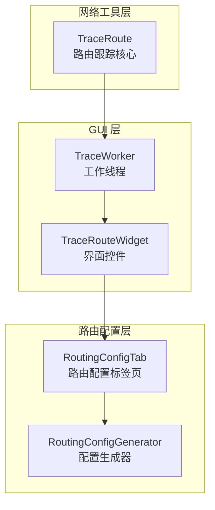
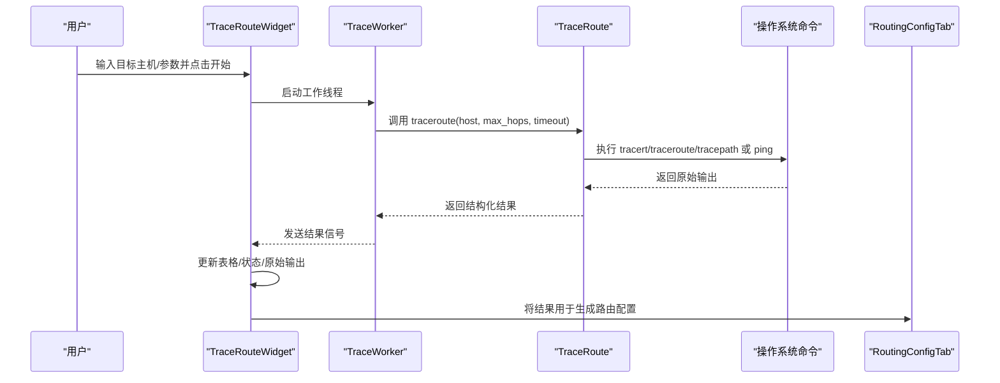
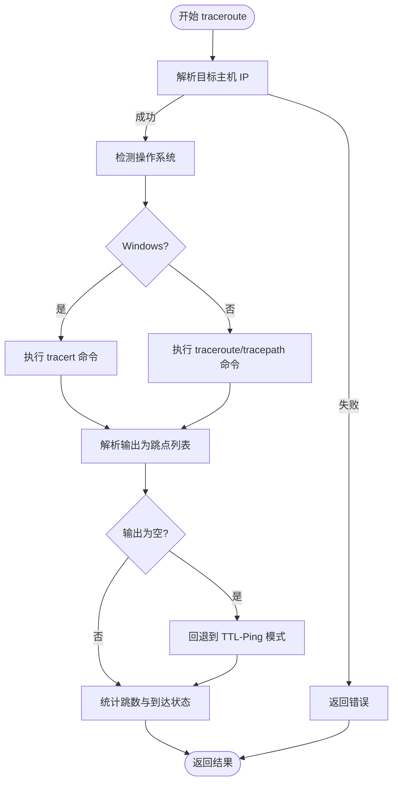
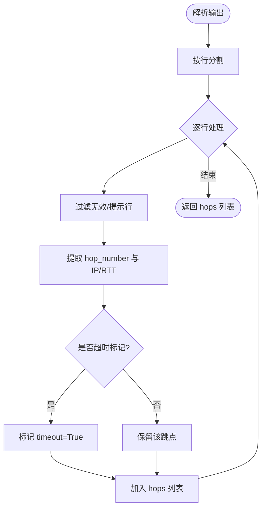
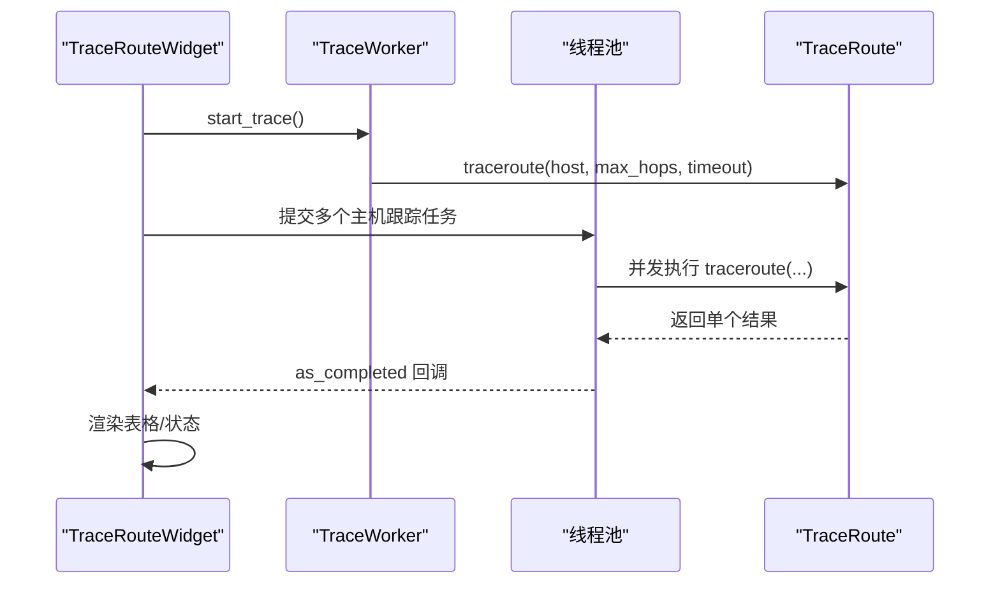

# 路由跟踪API

<cite>
**本文引用的文件**
- [trace_route.py](file://opensource/NetOps-toolkit/utils/network_tools/trace_route.py)
- [trace_tool.py](file://opensource/NetOps-toolkit/gui/tools/trace_tool.py)
- [routing_tab.py](file://opensource/NetOps-toolkit/gui/tabs/routing_tab.py)
- [routing_config.py](file://opensource/NetOps-toolkit/modules/routing_config.py)
</cite>

## 目录
1. [简介](#简介)
2. [项目结构](#项目结构)
3. [核心组件](#核心组件)
4. [架构概览](#架构概览)
5. [详细组件分析](#详细组件分析)
6. [依赖分析](#依赖分析)
7. [性能考虑](#性能考虑)
8. [故障排查指南](#故障排查指南)
9. [结论](#结论)
10. [附录](#附录)

## 简介
本文件为 TraceRoute 类的完整 API 参考文档，聚焦于路由跟踪能力与跨平台实现细节。内容涵盖：
- trace() 方法的参数与返回值规范
- 路由跟踪工作原理与协议支持（Windows tracert、Linux traceroute/tracepath）
- 路由路径解析与跳点统计
- 跨平台兼容性处理（Windows、Linux、macOS）
- 结果数据结构与异常检测机制
- 实际网络故障诊断应用场景与分析方法

## 项目结构
与路由跟踪直接相关的模块分布如下：
- 核心实现：utils/network_tools/trace_route.py
- GUI 工作线程与界面：gui/tools/trace_tool.py
- 路由配置标签页（与路由跟踪结果结合使用）：gui/tabs/routing_tab.py
- 路由配置生成器（用于生成设备配置命令）：modules/routing_config.py

图表来源
- [trace_route.py:14-299](file://opensource/NetOps-toolkit/utils/network_tools/trace_route.py#L14-L299)
- [trace_tool.py:27-232](file://opensource/NetOps-toolkit/gui/tools/trace_tool.py#L27-L232)
- [routing_tab.py:14-409](file://opensource/NetOps-toolkit/gui/tabs/routing_tab.py#L14-L409)
- [routing_config.py:8-213](file://opensource/NetOps-toolkit/modules/routing_config.py#L8-L213)

章节来源
- [trace_route.py:1-299](file://opensource/NetOps-toolkit/utils/network_tools/trace_route.py#L1-L299)
- [trace_tool.py:1-232](file://opensource/NetOps-toolkit/gui/tools/trace_tool.py#L1-L232)
- [routing_tab.py:1-409](file://opensource/NetOps-toolkit/gui/tabs/routing_tab.py#L1-L409)
- [routing_config.py:1-213](file://opensource/NetOps-toolkit/modules/routing_config.py#L1-L213)

## 核心组件
- TraceRoute：提供跨平台路由跟踪能力，支持 Windows tracert 与 Linux traceroute/tracepath，并具备回退的简单 TTL-Ping 模式。
- TraceWorker：在独立线程中执行路由跟踪，避免阻塞 GUI。
- TraceRouteWidget：图形化界面，展示跳点表格、状态与原始输出。
- RoutingConfigTab/RoutingConfigGenerator：用于生成设备路由配置，便于将网络诊断结果转化为设备配置。

章节来源
- [trace_route.py:14-299](file://opensource/NetOps-toolkit/utils/network_tools/trace_route.py#L14-L299)
- [trace_tool.py:27-232](file://opensource/NetOps-toolkit/gui/tools/trace_tool.py#L27-L232)
- [routing_tab.py:14-409](file://opensource/NetOps-toolkit/gui/tabs/routing_tab.py#L14-L409)
- [routing_config.py:8-213](file://opensource/NetOps-toolkit/modules/routing_config.py#L8-L213)

## 架构概览
下图展示了从用户触发到结果呈现的整体流程，以及与路由配置生成器的衔接：

图表来源
- [trace_tool.py:139-157](file://opensource/NetOps-toolkit/gui/tools/trace_tool.py#L139-L157)
- [trace_tool.py:38-41](file://opensource/NetOps-toolkit/gui/tools/trace_tool.py#L38-L41)
- [trace_route.py:18-77](file://opensource/NetOps-toolkit/utils/network_tools/trace_route.py#L18-L77)
- [routing_tab.py:316-347](file://opensource/NetOps-toolkit/gui/tabs/routing_tab.py#L316-L347)

## 详细组件分析

### TraceRoute 类 API 参考
- 类型：静态方法集合
- 主要方法：
  - traceroute(host: str, max_hops: int = 30, timeout: int = 2) -> Dict
  - trace_parallel(hosts: List[str], max_hops: int = 30, timeout: int = 2, max_workers: int = 5) -> List[Dict]

参数说明
- host：目标主机（域名或 IP）
- max_hops：最大跳数，默认 30
- timeout：超时时间（秒），默认 2
- max_workers：并行任务数，默认 5

返回值结构（traceroute）
- success: 是否成功获取有效路由信息
- host: 目标主机名
- ip_address: 解析到的目标 IP
- hops: 跳点列表（见“跳点数据结构”）
- total_hops: 总跳数
- reached_destination: 是否到达目标
- error: 错误信息（字符串）
- raw_output: 原始命令输出

跳点数据结构（hops 中的元素）
- hop_number: 跳数序号（整数）
- ip: 该跳的 IP 地址（字符串，可能为空）
- hostname: 主机名（字符串，解析逻辑依赖系统输出）
- rtt_times: 该跳的多次往返时间列表（毫秒，浮点）
- avg_rtt: 该跳的平均往返时间（毫秒，浮点）
- timeout: 是否超时（布尔）
- reached: 是否已到达目标（布尔）

章节来源
- [trace_route.py:18-77](file://opensource/NetOps-toolkit/utils/network_tools/trace_route.py#L18-L77)
- [trace_route.py:150-187](file://opensource/NetOps-toolkit/utils/network_tools/trace_route.py#L150-L187)

### traceroute 方法工作流程
- 解析目标主机 IP（失败则直接返回错误）
- 检测平台：Windows 使用 tracert；非 Windows 使用 traceroute 或 tracepath
- 执行系统命令并捕获输出，设置合理超时上限
- 优先解析系统命令输出；若无输出，则回退到基于 ping 的 TTL 探测模式
- 统计 total_hops 并判断是否到达目标
- 异常捕获并填充 error 字段

图表来源
- [trace_route.py:41-77](file://opensource/NetOps-toolkit/utils/network_tools/trace_route.py#L41-L77)
- [trace_route.py:105-123](file://opensource/NetOps-toolkit/utils/network_tools/trace_route.py#L105-L123)
- [trace_route.py:190-269](file://opensource/NetOps-toolkit/utils/network_tools/trace_route.py#L190-L269)

章节来源
- [trace_route.py:18-77](file://opensource/NetOps-toolkit/utils/network_tools/trace_route.py#L18-L77)
- [trace_route.py:105-123](file://opensource/NetOps-toolkit/utils/network_tools/trace_route.py#L105-L123)
- [trace_route.py:190-269](file://opensource/NetOps-toolkit/utils/network_tools/trace_route.py#L190-L269)

### 跳点解析与统计
- _parse_traceroute_output：按行解析系统输出，过滤无关行，提取跳点
- _parse_hop_line：从单行输出中提取 hop_number、ip、rtt_times、avg_rtt、timeout 标记
- _simple_traceroute：通过 ping 的 TTL 逐步探测，解析响应中的 IP 与 RTT，直到命中目标或达到最大跳数

图表来源
- [trace_route.py:126-145](file://opensource/NetOps-toolkit/utils/network_tools/trace_route.py#L126-L145)
- [trace_route.py:148-187](file://opensource/NetOps-toolkit/utils/network_tools/trace_route.py#L148-L187)

章节来源
- [trace_route.py:126-187](file://opensource/NetOps-toolkit/utils/network_tools/trace_route.py#L126-L187)

### 跨平台兼容性
- Windows：调用 tracert，使用 gbk 编码解码输出，超时控制为 max_hops × timeout × 3 秒
- Linux：优先尝试 traceroute，其次尝试 tracepath；均以 UTF-8 解码输出
- macOS：通过 platform 判断走 Linux 分支，因此依赖 traceroute 或 tracepath 命令存在性

章节来源
- [trace_route.py:48-53](file://opensource/NetOps-toolkit/utils/network_tools/trace_route.py#L48-L53)
- [trace_route.py:80-102](file://opensource/NetOps-toolkit/utils/network_tools/trace_route.py#L80-L102)
- [trace_route.py:105-123](file://opensource/NetOps-toolkit/utils/network_tools/trace_route.py#L105-L123)

### GUI 集成与并行跟踪
- TraceWorker：在独立线程中执行 traceroute，通过信号发送进度与结果
- TraceRouteWidget：负责输入校验、表格渲染、状态更新与原始输出切换
- trace_parallel：多主机并发跟踪，使用线程池限制并发度

图表来源
- [trace_tool.py:139-157](file://opensource/NetOps-toolkit/gui/tools/trace_tool.py#L139-L157)
- [trace_tool.py:27-42](file://opensource/NetOps-toolkit/gui/tools/trace_tool.py#L27-L42)
- [trace_route.py:272-298](file://opensource/NetOps-toolkit/utils/network_tools/trace_route.py#L272-L298)

章节来源
- [trace_tool.py:27-232](file://opensource/NetOps-toolkit/gui/tools/trace_tool.py#L27-L232)
- [trace_route.py:272-298](file://opensource/NetOps-toolkit/utils/network_tools/trace_route.py#L272-L298)

### 路由配置生成（与路由跟踪结果结合）
- RoutingConfigTab：提供静态路由、OSPF、BGP、RIP 的配置输入与管理
- RoutingConfigGenerator：根据输入配置生成设备命令文本，便于将网络诊断结果转化为可部署的设备配置

章节来源
- [routing_tab.py:14-409](file://opensource/NetOps-toolkit/gui/tabs/routing_tab.py#L14-L409)
- [routing_config.py:8-213](file://opensource/NetOps-toolkit/modules/routing_config.py#L8-L213)

## 依赖分析
- TraceRoute 依赖 Python 标准库（subprocess、platform、re、socket、typing）
- GUI 层依赖 PyQt5，通过 TraceWorker 与 TraceRoute 解耦
- 路由配置层与路由跟踪结果解耦，仅在需要时生成配置文本

图表来源
- [trace_route.py:7-11](file://opensource/NetOps-toolkit/utils/network_tools/trace_route.py#L7-L11)
- [trace_tool.py:16-24](file://opensource/NetOps-toolkit/gui/tools/trace_tool.py#L16-L24)
- [routing_tab.py:11-11](file://opensource/NetOps-toolkit/gui/tabs/routing_tab.py#L11-L11)

章节来源
- [trace_route.py:7-11](file://opensource/NetOps-toolkit/utils/network_tools/trace_route.py#L7-L11)
- [trace_tool.py:16-24](file://opensource/NetOps-toolkit/gui/tools/trace_tool.py#L16-L24)
- [routing_tab.py:11-11](file://opensource/NetOps-toolkit/gui/tabs/routing_tab.py#L11-L11)

## 性能考虑
- 命令超时：traceroute 命令的通信超时为 max_hops × timeout × 3 秒，避免长时间阻塞
- 并发控制：trace_parallel 通过 max_workers 控制并发度，防止资源争用
- 回退策略：当系统命令无输出时自动切换到 TTL-Ping 模式，提升成功率
- 输出编码：Windows 使用 gbk，Linux 使用 utf-8，避免乱码导致解析失败

章节来源
- [trace_route.py:97-98](file://opensource/NetOps-toolkit/utils/network_tools/trace_route.py#L97-L98)
- [trace_route.py:116-117](file://opensource/NetOps-toolkit/utils/network_tools/trace_route.py#L116-L117)
- [trace_route.py:280-298](file://opensource/NetOps-toolkit/utils/network_tools/trace_route.py#L280-L298)

## 故障排查指南
常见问题与处理建议
- 无法解析主机名：检查 DNS 设置或使用 IP 直连
- 系统命令不可用：确认 tracert/traceroute/tracepath 是否安装；Windows 上可尝试以管理员权限运行
- 输出为空：触发回退逻辑（TTL-Ping），若仍失败，增大 timeout 或减少 max_hops
- 超时频繁：适当提高 timeout；检查网络拥塞或中间设备丢包
- 路由中断：结合 RoutingConfigTab 生成静态/动态路由配置进行修复

章节来源
- [trace_route.py:44-46](file://opensource/NetOps-toolkit/utils/network_tools/trace_route.py#L44-L46)
- [trace_route.py:97-102](file://opensource/NetOps-toolkit/utils/network_tools/trace_route.py#L97-L102)
- [trace_route.py:116-123](file://opensource/NetOps-toolkit/utils/network_tools/trace_route.py#L116-L123)
- [trace_route.py:196-269](file://opensource/NetOps-toolkit/utils/network_tools/trace_route.py#L196-L269)

## 结论
TraceRoute 提供了统一、跨平台的路由跟踪能力，结合 GUI 与配置生成模块，能够快速定位网络路径问题并生成设备配置。通过合理的参数配置与异常处理，可在不同环境下稳定运行，并为网络故障诊断提供可靠依据。

## 附录

### API 速查表
- traceroute(host: str, max_hops: int = 30, timeout: int = 2) -> Dict
  - 返回字段：success、host、ip_address、hops、total_hops、reached_destination、error、raw_output
- trace_parallel(hosts: List[str], max_hops: int = 30, timeout: int = 2, max_workers: int = 5) -> List[Dict]

章节来源
- [trace_route.py:18-77](file://opensource/NetOps-toolkit/utils/network_tools/trace_route.py#L18-L77)
- [trace_route.py:272-298](file://opensource/NetOps-toolkit/utils/network_tools/trace_route.py#L272-L298)