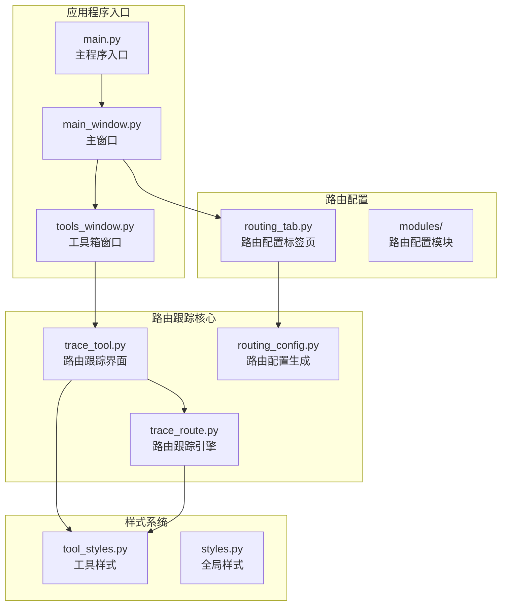
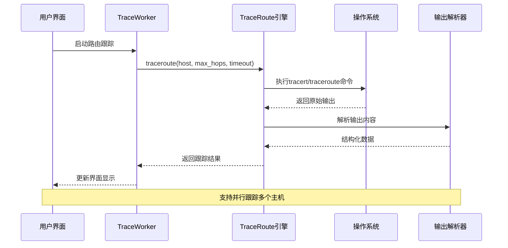
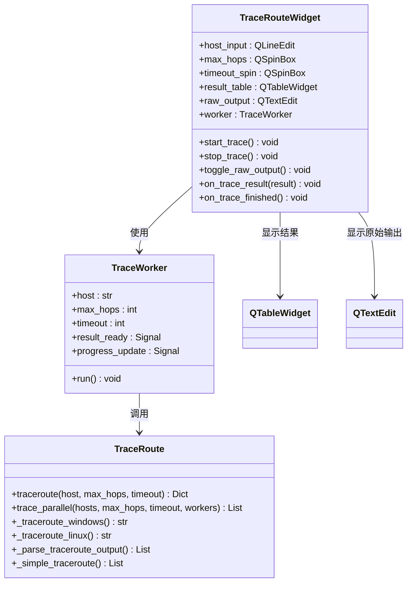
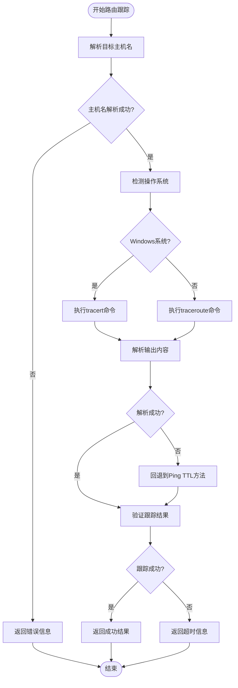
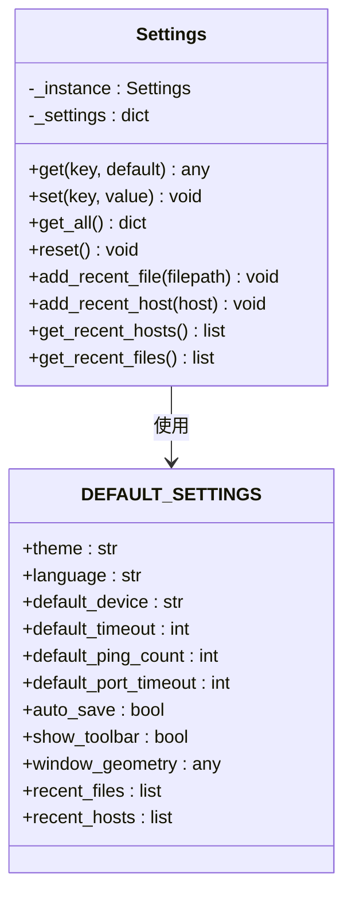
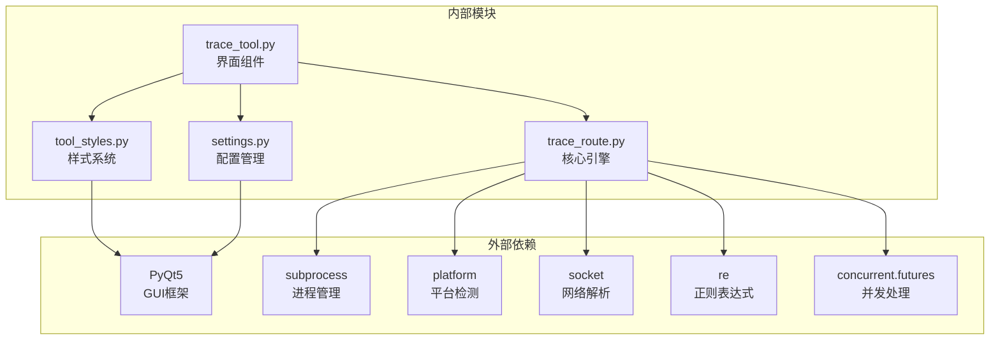

# 路由跟踪工具

<cite>
**本文档引用的文件**
- [main.py](file://opensource/NetOps-toolkit/main.py)
- [main_window.py](file://opensource/NetOps-toolkit/gui/main_window.py)
- [tools_window.py](file://opensource/NetOps-toolkit/gui/tools_window.py)
- [routing_tab.py](file://opensource/NetOps-toolkit/gui/tabs/routing_tab.py)
- [routing_config.py](file://opensource/NetOps-toolkit/modules/routing_config.py)
- [trace_tool.py](file://opensource/NetOps-toolkit/gui/tools/trace_tool.py)
- [trace_route.py](file://opensource/NetOps-toolkit/utils/network_tools/trace_route.py)
- [tool_styles.py](file://opensource/NetOps-toolkit/gui/tool_styles.py)
- [settings.py](file://opensource/NetOps-toolkit/utils/settings.py)
- [README.md](file://opensource/NetOps-toolkit/README.md)
</cite>

## 目录
1. [简介](#简介)
2. [项目结构](#项目结构)
3. [核心组件](#核心组件)
4. [架构概览](#架构概览)
5. [详细组件分析](#详细组件分析)
6. [依赖关系分析](#依赖关系分析)
7. [性能考虑](#性能考虑)
8. [故障排除指南](#故障排除指南)
9. [结论](#结论)
10. [附录](#附录)

## 简介

路由跟踪工具是NetOps Toolkit v4.0中的重要网络诊断组件，专门用于网络路径追踪和故障定位。该工具提供了直观的图形用户界面，支持Windows和Linux系统的路由跟踪功能，能够实时显示网络路径上的每个跳点信息，包括IP地址、主机名、延迟时间和连接状态。

该工具不仅支持单主机路由跟踪，还具备并行路由跟踪能力，可以同时对多个目标主机进行路径分析。通过详细的跳点信息和延迟分析，网络管理员可以有效识别网络瓶颈、路由异常和连接问题。

## 项目结构

NetOps Toolkit采用模块化架构设计，路由跟踪工具作为网络工具箱的重要组成部分，与其他网络诊断工具协同工作。

**图表来源**
- [main.py:25-44](file://opensource/NetOps-toolkit/main.py#L25-L44)
- [main_window.py:498-548](file://opensource/NetOps-toolkit/gui/main_window.py#L498-L548)
- [tools_window.py:28-77](file://opensource/NetOps-toolkit/gui/tools_window.py#L28-L77)

**章节来源**
- [main.py:1-69](file://opensource/NetOps-toolkit/main.py#L1-L69)
- [README.md:107-153](file://opensource/NetOps-toolkit/README.md#L107-L153)

## 核心组件

路由跟踪工具由多个核心组件构成，每个组件负责特定的功能领域：

### 路由跟踪引擎
- **TraceRoute类**：提供跨平台的路由跟踪功能
- **跨平台支持**：Windows tracert和Linux traceroute/tracepath
- **智能解析**：自动解析不同平台的输出格式

### 图形用户界面
- **TraceRouteWidget**：主界面组件
- **TraceWorker**：后台工作线程
- **实时显示**：表格和原始输出显示

### 配置管理
- **设置系统**：超时、跳数等参数配置
- **历史记录**：最近主机列表管理
- **样式系统**：统一的视觉设计

**章节来源**
- [trace_route.py:14-78](file://opensource/NetOps-toolkit/utils/network_tools/trace_route.py#L14-L78)
- [trace_tool.py:44-138](file://opensource/NetOps-toolkit/gui/tools/trace_tool.py#L44-L138)
- [settings.py:27-85](file://opensource/NetOps-toolkit/utils/settings.py#L27-L85)

## 架构概览

路由跟踪工具采用分层架构设计，确保了良好的可维护性和扩展性。

**图表来源**
- [trace_tool.py:38-42](file://opensource/NetOps-toolkit/gui/tools/trace_tool.py#L38-L42)
- [trace_route.py:18-77](file://opensource/NetOps-toolkit/utils/network_tools/trace_route.py#L18-L77)

**章节来源**
- [trace_tool.py:27-42](file://opensource/NetOps-toolkit/gui/tools/trace_tool.py#L27-L42)
- [trace_route.py:79-124](file://opensource/NetOps-toolkit/utils/network_tools/trace_route.py#L79-L124)

## 详细组件分析

### 路由跟踪界面组件

路由跟踪界面提供了直观的操作体验和丰富的功能选项。

**图表来源**
- [trace_tool.py:44-232](file://opensource/NetOps-toolkit/gui/tools/trace_tool.py#L44-L232)
- [trace_route.py:14-299](file://opensource/NetOps-toolkit/utils/network_tools/trace_route.py#L14-L299)

#### 界面布局设计

界面采用现代化的设计风格，提供了清晰的功能分区：

- **追踪设置区域**：包含目标主机输入、最大跳数设置、超时配置和控制按钮
- **结果显示区域**：以表格形式展示详细的跳点信息
- **原始输出区域**：可选显示系统原始输出
- **状态指示区域**：实时显示操作状态和进度

#### 数据显示机制

系统采用表格和颜色编码相结合的方式展示路由跟踪结果：

- **跳数列**：显示路径上的跳点序号
- **IP地址列**：显示每个跳点的IP地址
- **主机名列**：显示解析的主机名信息
- **延迟列**：显示平均往返时间(ms)
- **状态列**：使用颜色标识不同的连接状态

**章节来源**
- [trace_tool.py:52-138](file://opensource/NetOps-toolkit/gui/tools/trace_tool.py#L52-L138)
- [trace_tool.py:139-232](file://opensource/NetOps-toolkit/gui/tools/trace_tool.py#L139-L232)

### 路由跟踪引擎

路由跟踪引擎是整个工具的核心，负责执行实际的网络路径追踪任务。

**图表来源**
- [trace_route.py:18-77](file://opensource/NetOps-toolkit/utils/network_tools/trace_route.py#L18-L77)
- [trace_route.py:126-188](file://opensource/NetOps-toolkit/utils/network_tools/trace_route.py#L126-L188)

#### 跨平台兼容性

系统实现了对不同操作系统的智能支持：

- **Windows系统**：使用内置的tracert命令，支持GBK编码处理
- **Linux系统**：优先使用traceroute，回退到tracepath
- **输出解析**：针对不同平台的输出格式进行专门解析

#### 并行跟踪功能

系统支持同时对多个目标主机进行路由跟踪：

- **线程池管理**：使用ThreadPoolExecutor控制并发数量
- **异步处理**：每个主机在独立线程中执行
- **结果聚合**：收集所有跟踪结果并统一处理

**章节来源**
- [trace_route.py:79-124](file://opensource/NetOps-toolkit/utils/network_tools/trace_route.py#L79-L124)
- [trace_route.py:271-299](file://opensource/NetOps-toolkit/utils/network_tools/trace_route.py#L271-L299)

### 设置管理系统

系统提供了灵活的配置管理功能，支持用户自定义各种参数。

**图表来源**
- [settings.py:27-111](file://opensource/NetOps-toolkit/utils/settings.py#L27-L111)

#### 配置参数说明

系统支持以下关键配置参数：

- **默认超时时间**：控制单次跟踪的超时设置
- **默认跳数限制**：设置最大跳数上限
- **最近主机列表**：自动保存常用目标主机
- **界面主题**：支持浅色和深色主题切换

**章节来源**
- [settings.py:12-24](file://opensource/NetOps-toolkit/utils/settings.py#L12-L24)
- [settings.py:68-111](file://opensource/NetOps-toolkit/utils/settings.py#L68-L111)

## 依赖关系分析

路由跟踪工具的依赖关系相对简单，主要依赖于标准库和PyQt5框架。

**图表来源**
- [trace_tool.py:7-24](file://opensource/NetOps-toolkit/gui/tools/trace_tool.py#L7-L24)
- [trace_route.py:7-11](file://opensource/NetOps-toolkit/utils/network_tools/trace_route.py#L7-L11)

### 模块间耦合度

路由跟踪工具展现了良好的模块化设计：

- **低耦合**：界面层与核心引擎分离
- **高内聚**：功能相关的组件紧密集成
- **清晰边界**：各模块职责明确，接口简洁

**章节来源**
- [trace_tool.py:16-24](file://opensource/NetOps-toolkit/gui/tools/trace_tool.py#L16-L24)
- [trace_route.py:1-12](file://opensource/NetOps-toolkit/utils/network_tools/trace_route.py#L1-L12)

## 性能考虑

路由跟踪工具在设计时充分考虑了性能优化和用户体验。

### 并发处理策略

系统采用多线程架构处理多个并发请求：

- **线程池大小**：默认5个并发线程，可根据需要调整
- **超时控制**：每个线程都有独立的超时机制
- **资源管理**：及时释放不再使用的线程资源

### 内存使用优化

- **增量解析**：逐行解析系统输出，避免内存峰值
- **结果缓存**：最近主机列表限制在20个以内
- **界面更新**：使用异步信号机制避免界面阻塞

### 网络性能监控

系统提供了多种网络性能指标：

- **延迟分析**：显示每个跳点的往返时间
- **超时检测**：识别网络连接问题
- **路径完整性**：验证是否到达目标主机

## 故障排除指南

### 常见问题及解决方案

#### 路由跟踪失败

**问题现象**：路由跟踪结果显示失败或超时

**可能原因**：
- 目标主机不可达
- 防火墙阻止ICMP请求
- 系统权限不足

**解决步骤**：
1. 验证目标主机可达性
2. 检查防火墙设置
3. 以管理员权限运行程序

#### 输出解析错误

**问题现象**：界面显示解析错误或空白结果

**可能原因**：
- 系统tracert/traceroute命令不可用
- 输出格式不兼容
- 编码问题

**解决步骤**：
1. 确认系统命令可用性
2. 检查输出编码设置
3. 尝试手动执行命令验证

#### 性能问题

**问题现象**：路由跟踪响应缓慢或界面卡顿

**可能原因**：
- 并发线程过多
- 网络环境复杂
- 系统资源不足

**解决步骤**：
1. 减少并发线程数量
2. 增加超时时间
3. 关闭不必要的程序

**章节来源**
- [trace_tool.py:159-211](file://opensource/NetOps-toolkit/gui/tools/trace_tool.py#L159-L211)
- [trace_route.py:74-77](file://opensource/NetOps-toolkit/utils/network_tools/trace_route.py#L74-L77)

## 结论

路由跟踪工具作为NetOps Toolkit的重要组成部分，展现了现代网络诊断工具的优秀设计。通过模块化架构、跨平台兼容性和直观的用户界面，该工具为网络管理员提供了强大的路径追踪能力。

### 主要优势

- **跨平台支持**：统一的API支持Windows和Linux系统
- **智能解析**：自动处理不同平台的输出格式
- **并发处理**：支持多主机并行跟踪
- **用户友好**：直观的界面设计和实时反馈

### 应用价值

该工具在网络故障诊断、性能监控和网络规划方面具有重要价值，能够帮助技术人员快速定位网络问题，优化网络性能，并为网络架构改进提供数据支持。

## 附录

### 使用场景示例

#### 跨网段路径分析
- 分析企业内部网络的路由路径
- 识别网络瓶颈和性能问题
- 验证VLAN间通信连通性

#### 国际网络路由测试
- 监测跨境网络连接质量
- 评估CDN节点性能
- 分析网络延迟分布

#### 网络性能监控
- 定期检查关键服务器连通性
- 监控网络路径变化趋势
- 生成网络健康报告

### 最佳实践建议

1. **合理设置超时时间**：根据网络环境调整超时参数
2. **控制并发数量**：避免对网络造成过大压力
3. **定期清理历史记录**：保持最近主机列表的有效性
4. **结合其他工具使用**：与Ping、端口扫描等工具配合使用