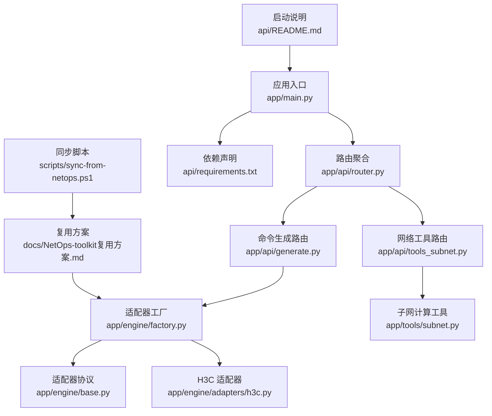
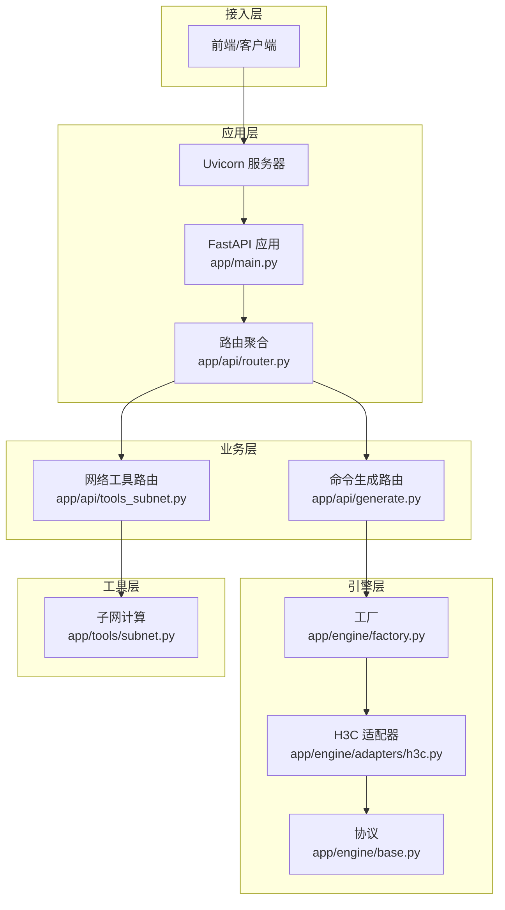
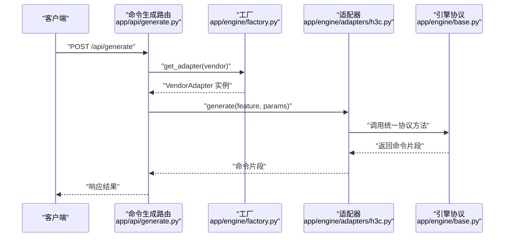
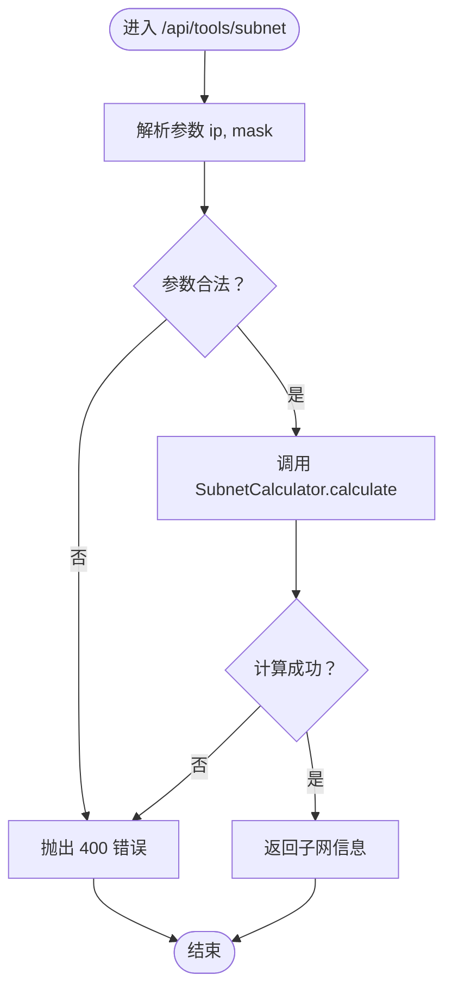
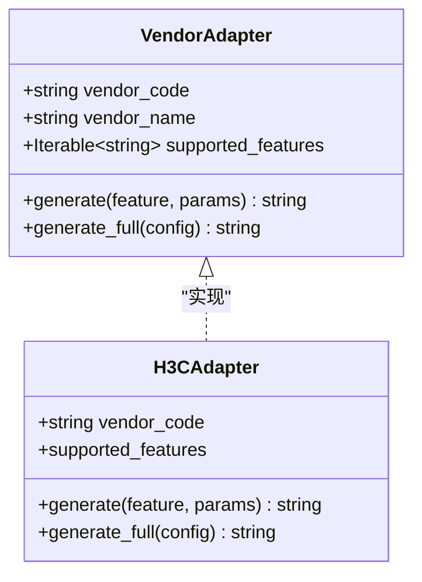
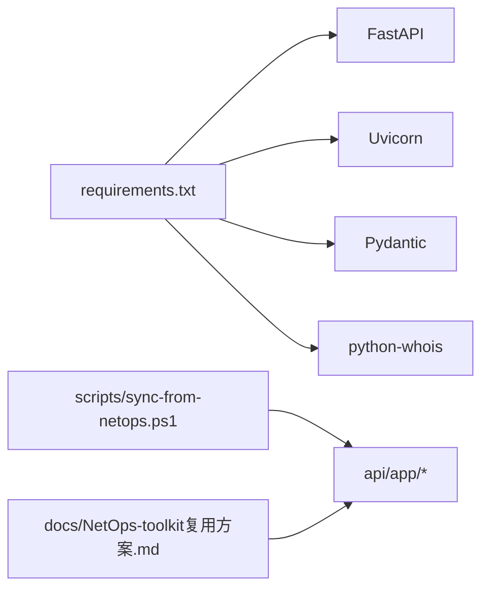

# 部署指南

<cite>
**本文引用的文件**   
- [api/README.md](file://api/README.md)
- [api/requirements.txt](file://api/requirements.txt)
- [api/app/main.py](file://api/app/main.py)
- [api/app/api/router.py](file://api/app/api/router.py)
- [api/app/api/generate.py](file://api/app/api/generate.py)
- [api/app/api/tools_subnet.py](file://api/app/api/tools_subnet.py)
- [api/app/engine/base.py](file://api/app/engine/base.py)
- [api/app/engine/factory.py](file://api/app/engine/factory.py)
- [api/app/engine/adapters/h3c.py](file://api/app/engine/adapters/h3c.py)
- [api/app/tools/subnet.py](file://api/app/tools/subnet.py)
- [scripts/sync-from-netops.ps1](file://scripts/sync-from-netops.ps1)
- [scripts/clone-opensource.ps1](file://scripts/clone-opensource.ps1)
- [docs/NetOps-toolkit复用方案.md](file://docs/NetOps-toolkit复用方案.md)
- [api/tests/sample-h3c-full.json](file://api/tests/sample-h3c-full.json)
- [api/tests/sample-h3c-vlan.json](file://api/tests/sample-h3c-vlan.json)
</cite>

## 目录
1. [简介](#简介)
2. [项目结构](#项目结构)
3. [核心组件](#核心组件)
4. [架构总览](#架构总览)
5. [详细组件分析](#详细组件分析)
6. [依赖分析](#依赖分析)
7. [性能考虑](#性能考虑)
8. [故障排查指南](#故障排查指南)
9. [结论](#结论)
10. [附录](#附录)

## 简介
本指南面向运维与开发团队，提供 NetCmdGen 项目的完整部署方案，涵盖开发与生产环境配置、依赖安装、环境变量与配置文件管理、Docker 容器化与云平台部署策略、监控与日志、性能调优、安全加固、备份与恢复、自动化部署与 CI/CD 集成，以及高可用与扩展性建议。项目后端基于 FastAPI，提供命令生成与网络工具能力，并通过适配器层统一封装多厂商配置生成内核。

## 项目结构
后端位于 api/ 目录，采用模块化组织：
- 应用入口与中间件：app/main.py
- 路由聚合：app/api/router.py
- 业务路由：app/api/generate.py（命令生成）、app/api/tools_subnet.py（子网工具）
- 引擎与适配器：app/engine/base.py（协议）、app/engine/factory.py（工厂）、app/engine/adapters/h3c.py（示例适配器）
- 网络工具：app/tools/subnet.py（子网计算）
- 依赖声明：api/requirements.txt
- 启动与示例：api/README.md
- 开源复用方案与脚本：docs/NetOps-toolkit复用方案.md、scripts/sync-from-netops.ps1、scripts/clone-opensource.ps1
- 测试样例：api/tests/sample-h3c-full.json、api/tests/sample-h3c-vlan.json

图表来源
- [api/app/main.py:1-29](file://api/app/main.py#L1-L29)
- [api/app/api/router.py:1-10](file://api/app/api/router.py#L1-L10)
- [api/app/api/generate.py:1-77](file://api/app/api/generate.py#L1-L77)
- [api/app/api/tools_subnet.py:1-50](file://api/app/api/tools_subnet.py#L1-L50)
- [api/app/engine/factory.py:1-39](file://api/app/engine/factory.py#L1-L39)
- [api/app/engine/base.py:1-36](file://api/app/engine/base.py#L1-L36)
- [api/app/engine/adapters/h3c.py:1-42](file://api/app/engine/adapters/h3c.py#L1-L42)
- [api/app/tools/subnet.py:1-280](file://api/app/tools/subnet.py#L1-L280)
- [api/requirements.txt:1-5](file://api/requirements.txt#L1-L5)
- [api/README.md:1-47](file://api/README.md#L1-L47)
- [docs/NetOps-toolkit复用方案.md:1-263](file://docs/NetOps-toolkit复用方案.md#L1-L263)
- [scripts/sync-from-netops.ps1:1-121](file://scripts/sync-from-netops.ps1#L1-L121)

章节来源
- [api/README.md:1-47](file://api/README.md#L1-L47)
- [api/app/main.py:1-29](file://api/app/main.py#L1-L29)
- [api/app/api/router.py:1-10](file://api/app/api/router.py#L1-L10)
- [api/app/api/generate.py:1-77](file://api/app/api/generate.py#L1-L77)
- [api/app/api/tools_subnet.py:1-50](file://api/app/api/tools_subnet.py#L1-L50)
- [api/app/engine/base.py:1-36](file://api/app/engine/base.py#L1-L36)
- [api/app/engine/factory.py:1-39](file://api/app/engine/factory.py#L1-L39)
- [api/app/engine/adapters/h3c.py:1-42](file://api/app/engine/adapters/h3c.py#L1-L42)
- [api/app/tools/subnet.py:1-280](file://api/app/tools/subnet.py#L1-L280)
- [api/requirements.txt:1-5](file://api/requirements.txt#L1-L5)
- [docs/NetOps-toolkit复用方案.md:1-263](file://docs/NetOps-toolkit复用方案.md#L1-L263)
- [scripts/sync-from-netops.ps1:1-121](file://scripts/sync-from-netops.ps1#L1-L121)

## 核心组件
- 应用入口与中间件：定义 FastAPI 应用、CORS 中间件与健康检查端点。
- 路由层：聚合命令生成与网络工具子路由。
- 命令生成 API：支持按特性生成命令片段与按完整配置生成脚本，返回统一响应模型。
- 网络工具 API：提供子网计算、子网划分、IP 范围转 CIDR 等工具。
- 引擎与适配器：通过工厂模式按厂商代码获取适配器，适配器实现统一协议，屏蔽厂商接口差异。
- 子网计算工具：纯函数实现 IP/掩码互转、网络/广播地址、可用主机范围、CIDR 转换等。

章节来源
- [api/app/main.py:1-29](file://api/app/main.py#L1-L29)
- [api/app/api/router.py:1-10](file://api/app/api/router.py#L1-L10)
- [api/app/api/generate.py:1-77](file://api/app/api/generate.py#L1-L77)
- [api/app/api/tools_subnet.py:1-50](file://api/app/api/tools_subnet.py#L1-L50)
- [api/app/engine/base.py:1-36](file://api/app/engine/base.py#L1-L36)
- [api/app/engine/factory.py:1-39](file://api/app/engine/factory.py#L1-L39)
- [api/app/engine/adapters/h3c.py:1-42](file://api/app/engine/adapters/h3c.py#L1-L42)
- [api/app/tools/subnet.py:1-280](file://api/app/tools/subnet.py#L1-L280)

## 架构总览
后端采用“路由层-业务层-引擎层-适配器层”的分层架构，通过适配器工厂统一对外提供厂商能力，路由层负责参数校验与异常处理，工具层提供网络工具与数据支撑。

图表来源
- [api/app/main.py:1-29](file://api/app/main.py#L1-L29)
- [api/app/api/router.py:1-10](file://api/app/api/router.py#L1-L10)
- [api/app/api/generate.py:1-77](file://api/app/api/generate.py#L1-L77)
- [api/app/api/tools_subnet.py:1-50](file://api/app/api/tools_subnet.py#L1-L50)
- [api/app/engine/factory.py:1-39](file://api/app/engine/factory.py#L1-L39)
- [api/app/engine/base.py:1-36](file://api/app/engine/base.py#L1-L36)
- [api/app/engine/adapters/h3c.py:1-42](file://api/app/engine/adapters/h3c.py#L1-L42)
- [api/app/tools/subnet.py:1-280](file://api/app/tools/subnet.py#L1-L280)

## 详细组件分析

### 命令生成流程（序列图）

图表来源
- [api/app/api/generate.py:53-76](file://api/app/api/generate.py#L53-L76)
- [api/app/engine/factory.py:20-26](file://api/app/engine/factory.py#L20-L26)
- [api/app/engine/adapters/h3c.py:32-38](file://api/app/engine/adapters/h3c.py#L32-L38)
- [api/app/engine/base.py:19-27](file://api/app/engine/base.py#L19-L27)

章节来源
- [api/app/api/generate.py:1-77](file://api/app/api/generate.py#L1-L77)
- [api/app/engine/factory.py:1-39](file://api/app/engine/factory.py#L1-L39)
- [api/app/engine/adapters/h3c.py:1-42](file://api/app/engine/adapters/h3c.py#L1-L42)
- [api/app/engine/base.py:1-36](file://api/app/engine/base.py#L1-L36)

### 子网计算流程（流程图）

图表来源
- [api/app/api/tools_subnet.py:9-22](file://api/app/api/tools_subnet.py#L9-L22)
- [api/app/tools/subnet.py:51-166](file://api/app/tools/subnet.py#L51-L166)

章节来源
- [api/app/api/tools_subnet.py:1-50](file://api/app/api/tools_subnet.py#L1-L50)
- [api/app/tools/subnet.py:1-280](file://api/app/tools/subnet.py#L1-L280)

### 类关系图（适配器与协议）

图表来源
- [api/app/engine/base.py:11-27](file://api/app/engine/base.py#L11-L27)
- [api/app/engine/adapters/h3c.py:14-42](file://api/app/engine/adapters/h3c.py#L14-L42)

章节来源
- [api/app/engine/base.py:1-36](file://api/app/engine/base.py#L1-L36)
- [api/app/engine/adapters/h3c.py:1-42](file://api/app/engine/adapters/h3c.py#L1-L42)

## 依赖分析
- 后端运行时依赖：FastAPI、Uvicorn、Pydantic、python-whois。
- 依赖声明位于 requirements.txt。
- 项目通过脚本将 NetOps-toolkit 的可复用模块同步至 api/app，确保版本升级与一致性。

图表来源
- [api/requirements.txt:1-5](file://api/requirements.txt#L1-L5)
- [scripts/sync-from-netops.ps1:1-121](file://scripts/sync-from-netops.ps1#L1-L121)
- [docs/NetOps-toolkit复用方案.md:1-263](file://docs/NetOps-toolkit复用方案.md#L1-L263)

章节来源
- [api/requirements.txt:1-5](file://api/requirements.txt#L1-L5)
- [scripts/sync-from-netops.ps1:1-121](file://scripts/sync-from-netops.ps1#L1-L121)
- [docs/NetOps-toolkit复用方案.md:1-263](file://docs/NetOps-toolkit复用方案.md#L1-L263)

## 性能考虑
- 并发与进程模型：生产环境建议使用多进程（如 uvicorn --workers N）以提升吞吐，注意适配器为无状态对象，可安全复用。
- 资源隔离：将子网计算等 CPU 密集型工具与命令生成解耦，必要时可引入队列或异步任务。
- 缓存策略：对常用命令速查与配置案例可做内存缓存，减少重复加载开销。
- 网络工具限制：对 ping/traceroute/portscan 等工具增加速率限制与白名单，避免被滥用导致资源耗尽。
- 日志采样与异步写入：生产日志建议异步落盘与轮转，避免阻塞主请求线程。

## 故障排查指南
- 健康检查：访问 /api/health 确认服务可用。
- CORS 问题：开发阶段允许跨域，生产需按域名精确配置。
- 厂商/特性不支持：工厂与适配器会抛出相应错误，检查 vendor 与 feature 是否在支持列表中。
- 子网计算错误：确认输入的 IP 与掩码/前缀合法，关注返回的错误信息。
- 端口扫描等工具异常：检查系统权限与容器内依赖是否满足要求。

章节来源
- [api/app/main.py:25-28](file://api/app/main.py#L25-L28)
- [api/app/api/generate.py:58-64](file://api/app/api/generate.py#L58-L64)
- [api/app/api/tools_subnet.py:20-22](file://api/app/api/tools_subnet.py#L20-L22)

## 结论
本指南提供了从开发到生产的完整部署路径，结合适配器工厂与网络工具模块，快速构建稳定、可扩展的命令生成与网络工具后端。建议在生产环境中启用严格的 CORS、速率限制与审计日志，并通过容器化与多副本实现高可用与弹性伸缩。

## 附录

### 开发环境搭建
- 克隆 NetOps-toolkit 可复用模块：使用脚本将源项目中的网络工具、校验器、命令速查与厂商生成器同步到 api/app。
- 安装依赖：pip install -r api/requirements.txt。
- 启动开发服务器：uvicorn app.main:app --reload --port 8000。
- 访问接口：健康检查、子网工具、接口文档等。

章节来源
- [scripts/clone-opensource.ps1:1-107](file://scripts/clone-opensource.ps1#L1-L107)
- [scripts/sync-from-netops.ps1:1-121](file://scripts/sync-from-netops.ps1#L1-L121)
- [api/README.md:7-24](file://api/README.md#L7-L24)
- [api/requirements.txt:1-5](file://api/requirements.txt#L1-L5)

### 生产环境配置要点
- 进程与并发：多进程运行，合理设置 workers 数量。
- CORS 白名单：仅允许受信前端域名。
- 速率限制与鉴权：对网络工具与敏感接口启用登录与限流。
- 日志与监控：接入统一日志与指标采集，开启健康检查与告警。
- 证书与 HTTPS：生产环境启用 TLS，配置证书与安全头。

### Docker 容器化部署
- 基础镜像：选择 Python 官方镜像作为基础。
- 安装依赖：COPY requirements.txt 并 pip install。
- 复用模块：在构建阶段执行同步脚本，将 NetOps-toolkit 源码复制到 api/app。
- 运行命令：uvicorn app.main:app --host 0.0.0.0 --port 8000。
- 容器内依赖：如需执行 ping/traceroute，需在镜像中安装相应系统包。
- 健康检查：在容器编排中配置 HTTP 健康检查 /api/health。

章节来源
- [api/README.md:7-24](file://api/README.md#L7-L24)
- [docs/NetOps-toolkit复用方案.md:218-223](file://docs/NetOps-toolkit复用方案.md#L218-L223)

### 云平台部署策略
- 容器编排：Kubernetes/Cloud Foundry/Docker Swarm，使用 Deployment/Service/Ingress。
- 高可用：多副本、就绪/存活探针、滚动更新。
- 存储：持久化配置与日志目录，避免容器重启丢失。
- 网络：限制出站访问，仅放行必要的上游服务。

### 监控与日志
- 指标：QPS、延迟、错误率、并发连接数、CPU/内存使用。
- 日志：请求日志、业务日志、错误日志，支持异步写入与轮转。
- 告警：阈值触发与异常检测，结合链路追踪定位瓶颈。

### 性能调优参数
- Uvicorn：workers、backlog、timeout_keepalive、limit_concurrency。
- FastAPI：启用 gzip/br 压缩，合理设置响应缓存。
- 数据缓存：对命令速查与配置案例进行内存缓存。
- 网络工具：限频、白名单、超时控制。

### 安全配置
- CORS：仅允许受信域名，避免通配符。
- 认证与授权：对敏感接口启用登录与权限校验。
- 输入校验：使用 Pydantic 模型与核心校验器。
- 依赖安全：定期更新依赖，扫描漏洞。

### 备份与恢复
- 配置备份：定期导出配置与命令速查数据。
- 日志备份：集中存储日志，保留至少 90 天。
- 恢复演练：定期进行灾难恢复演练，验证备份完整性。

### 自动化部署与 CI/CD
- 构建：在 CI 中执行依赖安装、同步脚本、单元测试。
- 打包：生成 Docker 镜像并推送至镜像仓库。
- 部署：通过流水线发布到预生产与生产环境，支持回滚。
- 发布：灰度发布与蓝绿部署，结合健康检查与自动回滚。

### 负载均衡、高可用与扩展性
- 负载均衡：Nginx/Traefik/云负载均衡器，健康检查与会话保持策略。
- 高可用：多副本部署，自动扩缩容，故障转移。
- 扩展性：水平扩展（多实例），垂直扩展（CPU/内存），异步任务队列处理耗时操作。

### API 与配置参考
- 命令生成接口：支持按特性生成命令片段与完整配置脚本。
- 子网工具接口：支持子网计算、子网划分、IP 范围转 CIDR。
- 厂商与特性：通过 /api/vendors 获取支持列表。

章节来源
- [api/app/api/generate.py:48-50](file://api/app/api/generate.py#L48-L50)
- [api/app/api/generate.py:53-76](file://api/app/api/generate.py#L53-L76)
- [api/app/api/tools_subnet.py:9-49](file://api/app/api/tools_subnet.py#L9-L49)
- [api/tests/sample-h3c-full.json:1-26](file://api/tests/sample-h3c-full.json#L1-L26)
- [api/tests/sample-h3c-vlan.json:1-19](file://api/tests/sample-h3c-vlan.json#L1-L19)