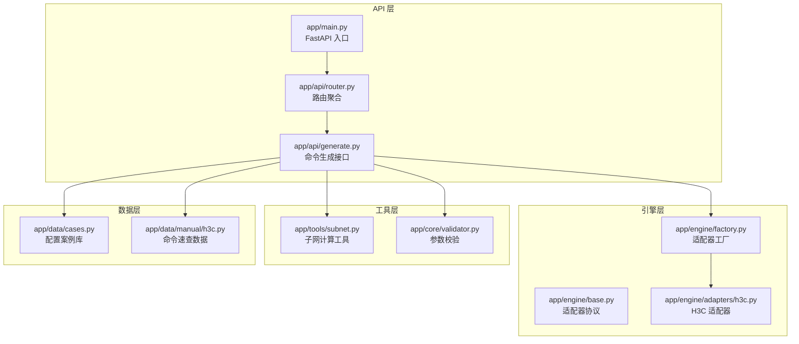
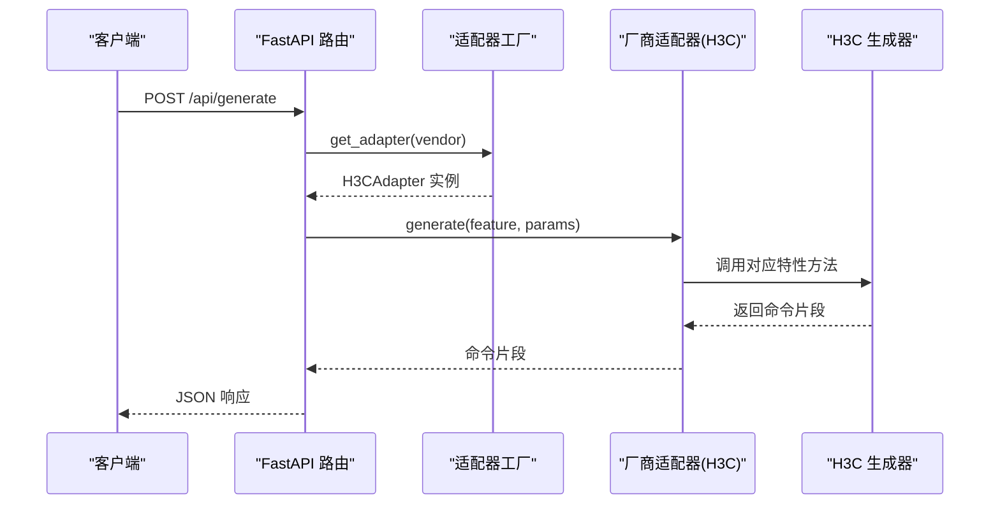
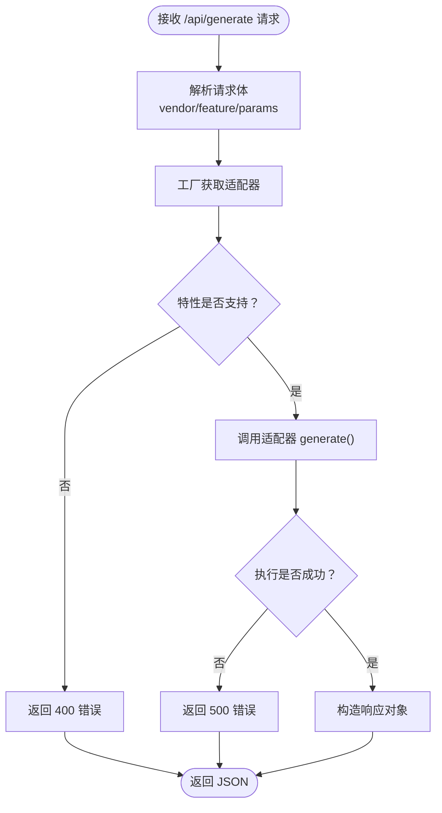
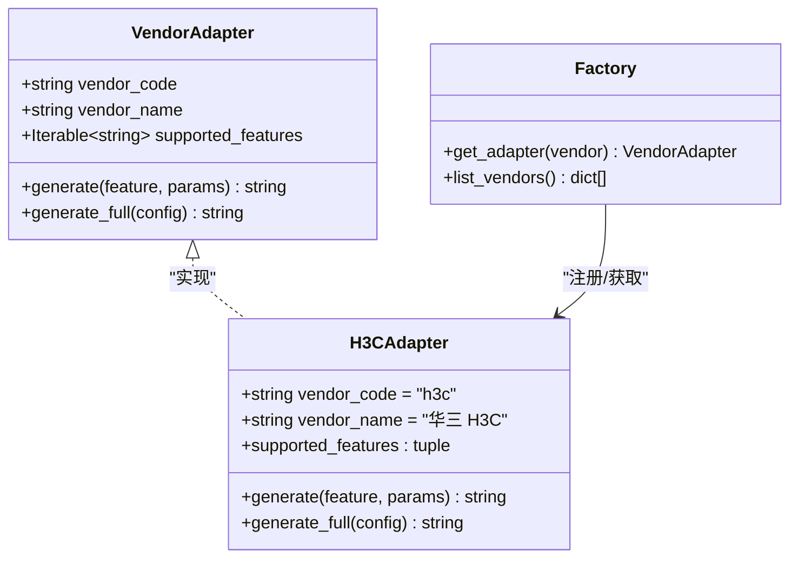
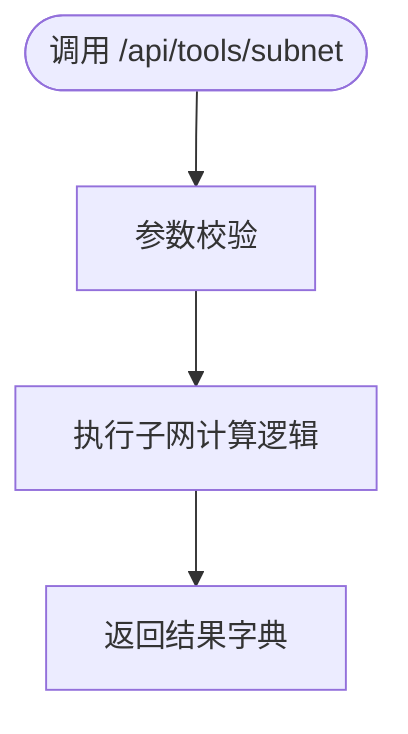
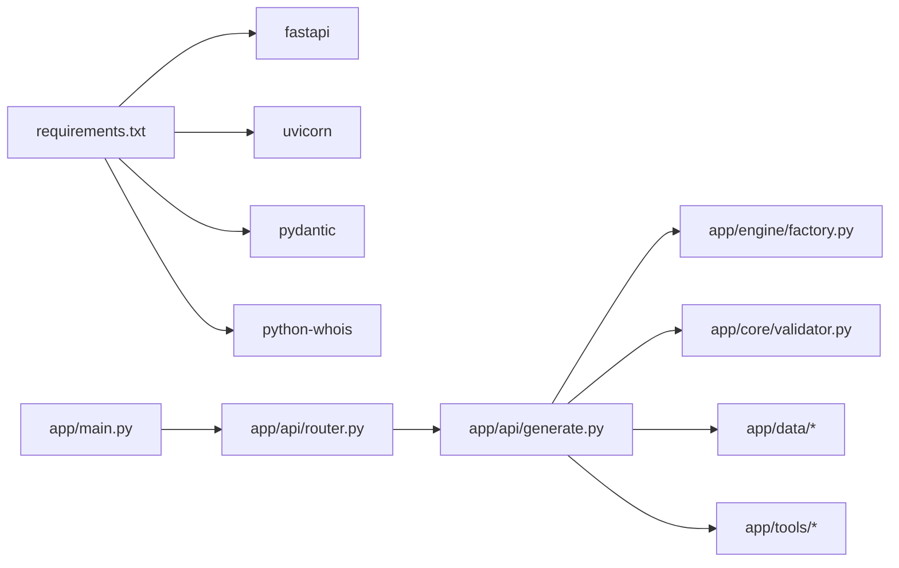

# 项目概述

<cite>
**本文档引用的文件**
- [api/README.md](file://api/README.md)
- [api/app/main.py](file://api/app/main.py)
- [api/app/api/router.py](file://api/app/api/router.py)
- [api/app/api/generate.py](file://api/app/api/generate.py)
- [api/app/engine/base.py](file://api/app/engine/base.py)
- [api/app/engine/factory.py](file://api/app/engine/factory.py)
- [api/app/engine/adapters/h3c.py](file://api/app/engine/adapters/h3c.py)
- [api/app/tools/subnet.py](file://api/app/tools/subnet.py)
- [api/app/core/validator.py](file://api/app/core/validator.py)
- [api/app/data/cases.py](file://api/app/data/cases.py)
- [api/app/data/manual/h3c.py](file://api/app/data/manual/h3c.py)
- [api/requirements.txt](file://api/requirements.txt)
- [docs/NetOps-toolkit复用方案.md](file://docs/NetOps-toolkit复用方案.md)
- [opensource/NetOps-toolkit/README.md](file://opensource/NetOps-toolkit/README.md)
- [scripts/sync-from-netops.ps1](file://scripts/sync-from-netops.ps1)
- [api/tests/sample-h3c-full.json](file://api/tests/sample-h3c-full.json)
</cite>

## 目录
1. [引言](#引言)
2. [项目结构](#项目结构)
3. [核心组件](#核心组件)
4. [架构总览](#架构总览)
5. [详细组件分析](#详细组件分析)
6. [依赖分析](#依赖分析)
7. [性能考虑](#性能考虑)
8. [故障排除指南](#故障排除指南)
9. [结论](#结论)
10. [附录](#附录)

## 引言
NetCmdGen 是一个基于 FastAPI 构建的网络配置命令生成服务，其核心目标是为多厂商网络设备（华为、H3C、锐捷、迈普）提供统一的命令生成与网络工具能力。项目通过复用开源项目 Flocks NetOps-toolkit 的成熟模块，快速实现“命令生成内核、网络工具集、命令速查数据”的一体化服务，显著缩短开发周期并提升质量。

- 业务价值：降低网络工程师在多厂商设备上重复编写配置命令的成本，提供标准化、可复用、可扩展的自动化生成能力。
- 目标用户：网络运维工程师、网络集成商、自动化平台开发者。
- 应用场景：设备初始配置、批量部署、配置模板化、网络工具辅助诊断、命令速查检索。

发展历程与技术选型：
- 项目采用“接口归一化 + 适配器模式”对 NetOps-toolkit 的多厂商 Generator 进行统一抽象，新增厂商仅需在适配层注册即可接入。
- 技术栈选择 Python 3.10 + FastAPI，充分利用现有 Python 生态与 NetOps-toolkit 的纯函数/模块化结构，避免不必要的框架迁移成本。
- 通过脚本自动化同步上游模块，确保复用效率与一致性。

架构优势：
- 分层清晰：路由层、适配器层、厂商生成器层职责明确，便于扩展与维护。
- 可扩展性强：新增厂商通过工厂注册与适配器映射即可快速上线。
- 复用收益高：约 5500+ 行可复用代码，M2/M3 阶段工作量压缩至原计划的 30%。

章节来源
- [api/README.md:1-47](file://api/README.md#L1-L47)
- [docs/NetOps-toolkit复用方案.md:1-263](file://docs/NetOps-toolkit复用方案.md#L1-L263)
- [opensource/NetOps-toolkit/README.md:1-236](file://opensource/NetOps-toolkit/README.md#L1-L236)

## 项目结构
NetCmdGen 的后端服务位于 api/ 目录，采用“路由层 + 引擎层 + 工具层 + 数据层”的分层组织方式，并通过工厂模式与适配器模式实现多厂商统一接入。

图表来源
- [api/app/main.py:1-29](file://api/app/main.py#L1-L29)
- [api/app/api/router.py:1-10](file://api/app/api/router.py#L1-L10)
- [api/app/api/generate.py:1-77](file://api/app/api/generate.py#L1-L77)
- [api/app/engine/base.py:1-36](file://api/app/engine/base.py#L1-L36)
- [api/app/engine/factory.py:1-39](file://api/app/engine/factory.py#L1-L39)
- [api/app/engine/adapters/h3c.py:1-42](file://api/app/engine/adapters/h3c.py#L1-L42)
- [api/app/tools/subnet.py:1-280](file://api/app/tools/subnet.py#L1-L280)
- [api/app/core/validator.py](file://api/app/core/validator.py)
- [api/app/data/cases.py:1-200](file://api/app/data/cases.py#L1-L200)
- [api/app/data/manual/h3c.py:1-200](file://api/app/data/manual/h3c.py#L1-L200)

章节来源
- [api/README.md:25-40](file://api/README.md#L25-L40)
- [api/app/main.py:1-29](file://api/app/main.py#L1-L29)
- [api/app/api/router.py:1-10](file://api/app/api/router.py#L1-L10)

## 核心组件
- FastAPI 应用入口：负责应用初始化、CORS 配置与路由挂载。
- 路由聚合：将工具与生成接口统一挂载到 /api 前缀下。
- 命令生成 API：提供“单特性命令片段生成”和“完整配置脚本生成”，并支持厂商列表查询。
- 引擎抽象与工厂：定义适配器协议，集中管理厂商适配器实例。
- 适配器层：针对不同厂商的 Generator 接口风格进行统一映射。
- 网络工具：提供子网计算、Ping、Traceroute、端口扫描、DNS/Whois 等纯函数工具。
- 数据与速查：内置配置案例库与命令速查数据，供前端检索与展示。

章节来源
- [api/app/main.py:1-29](file://api/app/main.py#L1-L29)
- [api/app/api/router.py:1-10](file://api/app/api/router.py#L1-L10)
- [api/app/api/generate.py:1-77](file://api/app/api/generate.py#L1-L77)
- [api/app/engine/base.py:1-36](file://api/app/engine/base.py#L1-L36)
- [api/app/engine/factory.py:1-39](file://api/app/engine/factory.py#L1-L39)
- [api/app/engine/adapters/h3c.py:1-42](file://api/app/engine/adapters/h3c.py#L1-L42)
- [api/app/tools/subnet.py:1-280](file://api/app/tools/subnet.py#L1-L280)
- [api/app/data/cases.py:1-200](file://api/app/data/cases.py#L1-L200)
- [api/app/data/manual/h3c.py:1-200](file://api/app/data/manual/h3c.py#L1-L200)

## 架构总览
NetCmdGen 采用“路由层 → 适配器工厂 → 厂商适配器 → 生成器”的调用链路，配合工具层与数据层，形成完整的命令生成与网络工具服务能力。

图表来源
- [api/app/api/generate.py:53-64](file://api/app/api/generate.py#L53-L64)
- [api/app/engine/factory.py:20-26](file://api/app/engine/factory.py#L20-L26)
- [api/app/engine/adapters/h3c.py:32-38](file://api/app/engine/adapters/h3c.py#L32-L38)

章节来源
- [api/app/api/generate.py:1-77](file://api/app/api/generate.py#L1-L77)
- [api/app/engine/factory.py:1-39](file://api/app/engine/factory.py#L1-L39)
- [api/app/engine/adapters/h3c.py:1-42](file://api/app/engine/adapters/h3c.py#L1-L42)

## 详细组件分析

### 命令生成 API 组件
- 功能：支持按厂商 + 特性 + 参数生成单段命令片段，或按厂商 + 完整配置生成完整脚本；提供厂商列表查询。
- 请求模型：GenerateRequest、GenerateFullRequest；响应模型：GenerateResponse。
- 错误处理：对厂商不支持、特性不支持、内部异常进行分类处理并返回标准 HTTP 状态码。

图表来源
- [api/app/api/generate.py:53-76](file://api/app/api/generate.py#L53-L76)

章节来源
- [api/app/api/generate.py:1-77](file://api/app/api/generate.py#L1-L77)

### 适配器与工厂组件
- 适配器协议：统一 vendor_code、vendor_name、supported_features 与 generate/generate_full 方法签名。
- 工厂：集中注册与获取适配器实例，支持动态扩展新厂商。
- H3C 适配器：将特性码映射到 H3CConfigGenerator 的静态方法，实现“统一输入 → 多厂商输出”。

图表来源
- [api/app/engine/base.py:11-27](file://api/app/engine/base.py#L11-L27)
- [api/app/engine/adapters/h3c.py:14-42](file://api/app/engine/adapters/h3c.py#L14-L42)
- [api/app/engine/factory.py:20-38](file://api/app/engine/factory.py#L20-L38)

章节来源
- [api/app/engine/base.py:1-36](file://api/app/engine/base.py#L1-L36)
- [api/app/engine/factory.py:1-39](file://api/app/engine/factory.py#L1-L39)
- [api/app/engine/adapters/h3c.py:1-42](file://api/app/engine/adapters/h3c.py#L1-L42)

### 网络工具组件
- 子网计算：提供 IP/掩码互转、前缀长度转换、网络/广播地址计算、可用主机数统计、子网划分、CIDR 合并等功能。
- 其他工具：Ping、Traceroute、端口扫描、DNS/Whois 等，均以纯函数形式存在，便于在 FastAPI 中直接作为路由使用。

图表来源
- [api/app/tools/subnet.py:50-166](file://api/app/tools/subnet.py#L50-L166)

章节来源
- [api/app/tools/subnet.py:1-280](file://api/app/tools/subnet.py#L1-L280)

### 数据与速查组件
- 配置案例库：涵盖基础、VLAN、路由、安全、接口等场景的参考配置，便于前端模板化展示与教学使用。
- 命令速查：按厂商与类别组织的命令手册，支持前端搜索与导航。

章节来源
- [api/app/data/cases.py:1-200](file://api/app/data/cases.py#L1-L200)
- [api/app/data/manual/h3c.py:1-200](file://api/app/data/manual/h3c.py#L1-L200)

## 依赖分析
- 外部依赖：FastAPI、Uvicorn、Pydantic、python-whois。
- 内部依赖：路由层依赖引擎工厂与适配器；生成接口依赖参数校验与数据资源；工具接口依赖纯函数工具。

图表来源
- [api/requirements.txt:1-5](file://api/requirements.txt#L1-L5)
- [api/app/main.py:1-29](file://api/app/main.py#L1-L29)
- [api/app/api/router.py:1-10](file://api/app/api/router.py#L1-L10)
- [api/app/api/generate.py:1-77](file://api/app/api/generate.py#L1-L77)

章节来源
- [api/requirements.txt:1-5](file://api/requirements.txt#L1-L5)

## 性能考虑
- 并发与稳定性：适配器为无状态对象，可安全复用；Generator 类为静态方法，适合并发调用。
- 网络工具安全：端口扫描等工具需增加鉴权、限频与目标白名单策略，防止滥用。
- 容器化部署：在 Docker 环境中需安装 ping/traceroute 等系统工具以支持相关功能。
- 测试策略：由于部分生成器输出包含时间戳，测试时需进行 mock 处理以保证一致性。

章节来源
- [docs/NetOps-toolkit复用方案.md:217-227](file://docs/NetOps-toolkit复用方案.md#L217-L227)

## 故障排除指南
- 厂商不支持：检查 /api/generate 请求中的 vendor 是否已在工厂注册。
- 特性不支持：确认特性码是否在适配器的 supported_features 列表中。
- 参数错误：使用参数校验工具进行前置校验，减少无效请求。
- 健康检查：访问 /api/health 确认服务正常运行。
- 示例请求：可参考测试样例，确保配置结构与参数格式正确。

章节来源
- [api/app/api/generate.py:58-63](file://api/app/api/generate.py#L58-L63)
- [api/app/main.py:25-28](file://api/app/main.py#L25-L28)
- [api/tests/sample-h3c-full.json:1-26](file://api/tests/sample-h3c-full.json#L1-L26)

## 结论
NetCmdGen 通过“接口归一化 + 适配器模式 + 工厂注册”的架构设计，高效复用了 NetOps-toolkit 的成熟模块，实现了多厂商命令生成与网络工具的统一服务。项目具备良好的扩展性与可维护性，能够快速支撑更多厂商与功能的迭代，为网络运维自动化提供坚实基础。

## 附录
- 快速启动流程：执行同步脚本、安装依赖、启动开发服务器。
- 复用清单：工具、校验器、命令速查、配置案例与厂商生成器的迁移路径。
- 合规与风险：MIT 许可证要求、命令准确性风险与网络工具安全风险提示。

章节来源
- [api/README.md:7-24](file://api/README.md#L7-L24)
- [docs/NetOps-toolkit复用方案.md:43-81](file://docs/NetOps-toolkit复用方案.md#L43-L81)
- [scripts/sync-from-netops.ps1:1-121](file://scripts/sync-from-netops.ps1#L1-L121)